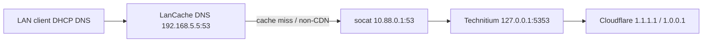

# DNS on ace (LanCache + Technitium)

Implementation: `nixos/containers/lancache.nix`, `nixos/containers/technitium.nix`, Caddy `nixos/caddy/technitium.nix`.

## Query path



1. **Clients** use DHCP DNS **192.168.5.5** (ace).
2. **LanCache DNS** answers hijacked game CDN names and forwards everything else upstream.
3. **Upstream** is **10.88.0.1:53** on the podman bridge - a host **socat** relay to **Technitium** on **127.0.0.1:5353** (not published on bond0).
4. **Technitium** recurses via forwarders **1.1.1.1** and **1.0.0.1**.

Ace itself keeps resolver **192.168.5.2** in `hosts/ace/default.nix` so the server does not loop through LanCache.

## Ports

| Service | Bind | Notes |
|---------|------|-------|
| LanCache DNS | `192.168.5.5:53` udp/tcp | House / game LAN DNS |
| Technitium DNS | `127.0.0.1:5353` udp/tcp | Upstream for LanCache only |
| Technitium UI | `127.0.0.1:5380` tcp | Caddy -> `dns.prestonhager.com` |
| Podman relay | `10.88.0.1:53` udp/tcp | Not routed from LAN; pod -> Technitium |

## Storage

- LanCache: `/stor/lancache`
- Technitium config/logs: `/stor/technitium`, `/stor/technitium/logs`

## Internal zone (`internal.prestonhager.com`)

NixOS provisions a **Primary** zone on Technitium via `technitium-internal-zone-bootstrap.service` (HTTP API after `podman-technitium` starts). Records:

| Name | Type | Address |
|------|------|---------|
| `ace.internal.prestonhager.com` | A | `192.168.5.5` |
| `crux.internal.prestonhager.com` | A | `192.168.5.6` |
| `nova.internal.prestonhager.com` | A | `192.168.5.7` |

The bootstrap job is idempotent (creates the zone if missing, overwrites the A records). It also deletes legacy `*.lc1.nm.us.prestonhager.com` zones (including `ip1.lc1...` style names) if Technitium had created them.

Technitium admin password: sops `secrets/containers/technitium.yaml` (`technitium-admin-password`). On first boot only, `DNS_SERVER_ADMIN_PASSWORD_FILE` initializes the web `admin` user.

Ace `/etc/hosts` mirrors the same names in `nixos/local-service-hosts.nix` for on-box tools that do not use LanCache DNS.

## Cloudflare DNS

Add a **proxied** record (same pattern as other ace Caddy apps):

| Type | Name | Content | Proxy |
|------|------|---------|-------|
| A | `dns` | `192.168.5.5` | Proxied (orange cloud) |

If you terminate TLS only on Caddy with public IP elsewhere, match your existing `*.prestonhager.com` pattern.

## Local hosts (ace)

`nixos/local-service-hosts.nix` includes **`dns.prestonhager.com`** -> `127.0.0.1`. Apply with your usual `nixos-rebuild switch` on ace.

## DHCP (house / game LAN)

Set **primary DNS** to **192.168.5.5** on the router or DHCP scope. Secondary optional (e.g. `1.1.1.1`); clients that use ace get caching + Technitium policy.

## Technitium first run

1. Deploy config and `nixos-rebuild switch --flake /etc/nixos#ace`.
2. Confirm `systemctl status technitium-internal-zone-bootstrap` is **active (exited)**.
3. Open **https://dns.prestonhager.com** (Caddy -> `http://127.0.0.1:5380`) and sign in as **`admin`** (password in sops).
4. Confirm forwarders **1.1.1.1 / 1.0.0.1** under Settings if you use a pre-existing data dir.

## Verify

```bash
# From a DHCP client using 192.168.5.5 as DNS
dig @192.168.5.5 ace.internal.prestonhager.com +short

# On ace - Technitium directly
dig @127.0.0.1 -p 5353 ace.internal.prestonhager.com +short

# Relay from podman bridge
dig @10.88.0.1 ace.internal.prestonhager.com +short
```

## Related

See also `docs/lancache-ace.md` for cache storage and HTTP ports.
## Internal zone (`internal.prestonhager.com`)

Authoritative LAN records are declared in `nixos/containers/technitium-internal-zone.nix` (`internalHosts` attribute set). On each boot, `technitium-sync-internal-zone.service` imports the generated zone file into Technitium via its HTTP API (idempotent; re-runs when the zone content hash changes).

| Host | A record | IP |
|------|----------|-----|
| ace | ace.internal.prestonhager.com | 192.168.5.5 |
| crux | crux.internal.prestonhager.com | 192.168.5.6 |
| nova | nova.internal.prestonhager.com | 192.168.5.7 |
| grafana | grafana.internal.prestonhager.com | 192.168.5.5 |
| cloud | cloud.internal.prestonhager.com | 192.168.5.5 |
| dns | dns.internal.prestonhager.com | 192.168.5.5 |

Technitium is configured with `DNS_SERVER_DOMAIN=internal.prestonhager.com` so the server does not default to `ip1.lc1.nm.us.prestonhager.com`-style automatic names. Do not create parallel `lc1.nm.us` zones in Technitium; Wings/public TLS continues to use `*.lc1.nm.us.prestonhager.com` via Cloudflare and `/etc/hosts` on ace.

### Add a host later

1. **Preferred:** Edit `internalHosts` in `technitium-internal-zone.nix`, bump `zoneSerial`, run `nixos-rebuild switch --flake /etc/nixos#ace`. Delete `/stor/technitium/.internal-zone.sha256` if you need to force a re-import without changing the serial.
2. **Ad hoc:** Technitium UI at https://dns.prestonhager.com → Zones → `internal.prestonhager.com` → add record. UI changes may be overwritten on the next sync unless you also update Nix.

### Reverse DNS (optional)

PTR for `192.168.5.0/24` is not managed in Nix today. Add a reverse zone in Technitium if you want `dig -x 192.168.5.5` to return `ace.internal.prestonhager.com`.

### Verify internal names

```bash
dig @192.168.5.5 ace.internal.prestonhager.com +short
dig @127.0.0.1 -p 5353 crux.internal.prestonhager.com +short
```
