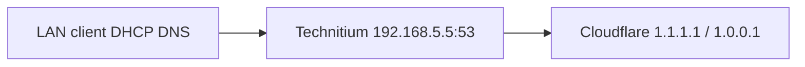

# DNS on ace (Technitium)

Implementation: `nixos/containers/technitium.nix`, `nixos/containers/technitium-zones.nix`, `nixos/containers/technitium-sso.nix`, Caddy `nixos/caddy/technitium.nix`.

LanCache (`nixos/containers/lancache.nix`) is **disabled** — it was slowing DNS resolution. Technitium is the primary LAN DNS server.

Physical path: [Network topology](network-topology.md) (Astracap DHCP hands clients DNS **192.168.5.5**).

## Query path



1. **Clients** use DHCP DNS **192.168.5.5** (ace / Technitium).
2. **Technitium** serves **Primary** zones for `internal.prestonhager.com` and `prestonhager.com`, then recurses other names via forwarders **1.1.1.1** and **1.0.0.1**.

Ace itself uses resolver **192.168.5.5** in `hosts/ace/default.nix` (Technitium on bond0).

## Ports

| Service | Bind | Notes |
|---------|------|-------|
| Technitium DNS | `192.168.5.5:53` udp/tcp | **Primary house / game LAN DNS** |
| Technitium DNS (loopback) | `127.0.0.1:5353` udp/tcp | Local diagnostics / `dig @127.0.0.1 -p 5353` |
| Technitium UI | `127.0.0.1:5380` tcp | Caddy → `dns.prestonhager.com` |
| Technitium DoH backend | `127.0.0.1:8053` tcp | DNS-over-HTTP; Caddy terminates TLS |
| Technitium DoT | `:853` tcp | Native TLS (PFX from Caddy LE cert) |
| Caddy DoH / HTTP/3 | `:443` tcp + udp | `https://dns.prestonhager.com/dns-query` |

Plain DNS on **192.168.5.5:53** (Technitium). Encrypted DNS is additive.

## Encrypted DNS (DoH, DoT, HTTP/3)

### Architecture

| Protocol | Termination | Backend | Client URL |
|----------|-------------|---------|------------|
| **DoH** | Caddy (Let's Encrypt via existing ace TLS) | Technitium DNS-over-HTTP on `127.0.0.1:8053` | `https://dns.prestonhager.com/dns-query` |
| **HTTP/3** | Caddy (`protocols h1 h2 h3`, UDP/443) | Same DoH path | Same URL (HTTP/3 when client supports QUIC) |
| **DoT** | Technitium native TLS | Technitium DNS TCP `:853` | `dns.prestonhager.com:853` |

Caddy handles DoH so TLS renewal stays centralized and HTTP/3 works without Technitium binding port 443. DoT uses Technitium's built-in listener; the LE certificate is exported from Caddy's on-disk cert store to PKCS#12 (`technitium-sync-tls-cert.service`) and applied via the Technitium API (`technitium-sync-protocols.service`).

Implementation: `nixos/caddy/technitium.nix`, `nixos/containers/technitium.nix`, `nixos/containers/technitium-protocols.nix`.

### Client configuration

| Client type | Setting |
|-------------|---------|
| DoH (browser, Android Private DNS, iOS profile) | `https://dns.prestonhager.com/dns-query` |
| DoT (Android, router, `systemd-resolved`) | `dns.prestonhager.com` port **853** |
| Plain DNS | `192.168.5.5` |

Recursion remains **AllowOnlyForPrivateNetworks** — LAN and RFC1918 clients get answers; public IPs may receive `REFUSED` unless you widen recursion in Technitium settings.

### Cloudflare DNS records

| Type | Name | Content | Proxy | Purpose |
|------|------|---------|-------|---------|
| CNAME | `dns` | `ip1.lc1.nm.us.prestonhager.com` | **DNS only (grey)** | DoH + web UI via Caddy :443 on ace WAN |

Do **not** orange-cloud names to `192.168.5.5` — Cloudflare cannot reach private LAN IPs and may return empty responses. LAN clients resolve via Technitium split-horizon to ace directly.

**DoT on port 853 does not traverse Cloudflare's HTTP proxy.** For encrypted DNS from the public Internet over DoT, use WAN IP / NAT to ace `:853`, or connect over LAN/VPN.

### Deploy encrypted DNS

After `nixos-rebuild switch --flake /etc/nixos#ace`:

```bash
systemctl status technitium-sync-tls-cert technitium-sync-protocols caddy
ss -tlnp | grep -E '8053|853|443'
```

## Storage

- Technitium config/logs: `/stor/technitium`, `/stor/technitium/logs`
- Zone sync hashes: `/stor/technitium/.internal-prestonhager-com-zone.sha256`, `/stor/technitium/.prestonhager-com-zone.sha256`
- LanCache data (unused): `/stor/lancache` — retained on disk; container disabled

## Zones (Nix → Technitium API)

Authoritative records live in `nixos/containers/technitium-zones.nix` (`internalHosts`, `prestonhagerHosts`). `technitium-sync-zones.service` logs into the Technitium HTTP API and imports generated zone files (idempotent; re-runs when a zone file hash changes).

Technitium is configured with `DNS_SERVER_DOMAIN=internal.prestonhager.com` so the server does not default to `ip1.lc1.nm.us.prestonhager.com`-style automatic names. Do not recreate `lc1.nm.us` zones in Technitium.

### Zone: `internal.prestonhager.com`

| Host | Type | Target / IP |
|------|------|-------------|
| ace | A | 192.168.5.5 |
| crux | A | 192.168.5.6 |
| nova | A | 192.168.5.7 |
| grafana | A | 192.168.5.5 |
| cloud | A | 192.168.5.5 |
| dns | A | 192.168.5.5 |

### Zone: `prestonhager.com` (LAN only)

This zone overrides public Cloudflare answers for LAN clients using ace as DNS. The apex is not defined here (no `@` A/AAAA); only listed subdomains are authoritative on Technitium.

| Name | Type | Target |
|------|------|--------|
| ace | CNAME | ace.internal.prestonhager.com |
| crux | CNAME | crux.internal.prestonhager.com |
| nova | CNAME | nova.internal.prestonhager.com |
| grafana | CNAME | grafana.internal.prestonhager.com |
| cloud | CNAME | cloud.internal.prestonhager.com |
| dns | CNAME | dns.internal.prestonhager.com |
| ai, panel, test.panel, prometheus, jellyfin, vault, wg, metrics.wg, zitadel, git, matrix, spacetime, test.sui, faucet.test.sui, indexer.test.sui, factorio, game, lancache, mc, vpn, serverdocs, update | CNAME | ace.internal.prestonhager.com |
| crux.lc1.nm.us | CNAME | crux.internal.prestonhager.com |
| nova.lc1.nm.us | CNAME | nova.internal.prestonhager.com |

External Cloudflare CNAMEs (blog, github.io sites, dontgetgot, ACM validation, etc.) and apex **MX/TXT/SRV** records are copied into the Technitium zone unchanged so LAN clients still resolve them without NXDOMAIN from the partial primary zone.

### Cloudflare `ip1.lc1` → LAN mapping

Public Cloudflare CNAMEs that target `ip1.lc1.nm.us.prestonhager.com` (73.26.67.25) are overridden on LAN as follows:

| Public name | LAN target |
|-------------|------------|
| cloud, dns, grafana | matching `*.internal.prestonhager.com` A → 192.168.5.5 |
| ace, ai, factorio, faucet.test.sui, game, indexer.test.sui, jellyfin, lancache, matrix, mc, metrics.wg, panel, prometheus, spacetime, test.panel, test.sui, update, vault, vpn, wg, zitadel, serverdocs | ace.internal.prestonhager.com → 192.168.5.5 |
| crux.lc1.nm.us | crux.internal.prestonhager.com → 192.168.5.6 |
| nova.lc1.nm.us | nova.internal.prestonhager.com → 192.168.5.7 |

### `lc1.nm.us.prestonhager.com` names (preferred for Wings / nodes)

These are the **preferred** hostnames for Pterodactyl Wings nodes and TLS — not being migrated away.

| Hostname | LAN (`@192.168.5.5`) | Public Internet |
|----------|----------------------|-----------------|
| `crux.lc1.nm.us.prestonhager.com` | **192.168.5.6** | **192.168.5.6** (Cloudflare A) |
| `nova.lc1.nm.us.prestonhager.com` | **192.168.5.7** | **192.168.5.7** (Cloudflare A) |
| `ip1.lc1.nm.us.prestonhager.com` | ace.internal → 192.168.5.5 | **73.26.67.25** (WAN / NAT to ace) |

Shorter aliases also resolve on LAN when DHCP DNS is 192.168.5.5:

| Name | Resolves via |
|------|--------------|
| `crux.prestonhager.com` | → crux.internal → 192.168.5.6 |
| `nova.prestonhager.com` | → nova.internal → 192.168.5.7 |
| `ace.prestonhager.com` | → ace.internal → 192.168.5.5 |
| Ace Caddy vhosts (`grafana.prestonhager.com`, etc.) | CNAME → ace.internal or matching `*.internal` |

Wings NFS TLS and Caddy certificates use `crux.lc1.nm.us.prestonhager.com` / `nova.lc1.nm.us.prestonhager.com` (`nixos/nfs/default.nix`, `nixos/caddy/pterodactyl.nix`).

## Cloudflare DNS (public Internet)

Public `prestonhager.com` records stay in Cloudflare; the Technitium zone is for split-horizon LAN resolution only.

### Ace Caddy apps (grafana, vault, cloud, panel, …)

Use **DNS only** (grey cloud). Do **not** orange-cloud these names to a private LAN IP — Cloudflare cannot reach `192.168.5.5` and may return **HTTP 200 with an empty body** (`Content-Length: 0`, `Server: cloudflare`) while LAN clients work fine.

Working pattern (same as grafana):

| Type | Name | Content | Proxy |
|------|------|---------|-------|
| CNAME | `vault` (and other ace apps) | `ip1.lc1.nm.us.prestonhager.com` | DNS only (grey) |
| CNAME | `update` | `ip1.lc1.nm.us.prestonhager.com` | DNS only (grey) — major upgrade approve/deny links |

`ip1.lc1.nm.us.prestonhager.com` A → `73.26.67.25` (Cisco WAN / NAT → ace `:443`).

After changing proxy status, purge Cloudflare cache for the hostname. Verify from outside LAN:

```bash
curl -sS -D - -o /dev/null -w 'bytes=%{size_download}\n' https://vault.prestonhager.com/
# expect bytes in the tens of thousands, not 0
```

### Technitium DoH (`dns.prestonhager.com`)

| Type | Name | Content | Proxy |
|------|------|---------|-------|
| CNAME | `dns` | `ip1.lc1.nm.us.prestonhager.com` | DNS only (grey) |

DoT on port 853 does not traverse Cloudflare's HTTP proxy; use WAN NAT or LAN/VPN (see above).

### Cloudflare DNS-01 for Caddy (automatic TLS)

**Status:** Enabled on ace via `homelab.caddy.cloudflareAcme.enable = true` (`nixos/caddy/acme-dns.nix`). Requires encrypted `secrets/cloudflare.yaml` in **nix-secrets**.

With DNS-01, Caddy creates temporary `_acme-challenge` TXT records in Cloudflare via API. You no longer need to add each new hostname to Cloudflare manually for **certificate issuance** — only for **client routing** (grey-cloud CNAME to `ip1.lc1` when the service must be reachable from the public Internet).

#### Token scopes (Cloudflare dashboard)

Create a **scoped API token** at [Cloudflare API tokens](https://dash.cloudflare.com/profile/api-tokens):

| Permission | Access | Purpose |
|------------|--------|---------|
| Zone → DNS → Edit | `prestonhager.com` | DNS-01 TXT + optional CNAME upsert |
| Zone → Zone → Read | `prestonhager.com` | Resolve zone id for API scripts |

One token covers both ACME and `scripts/ace-cloudflare-dns-sync.sh`.

#### Sops secret (nix-secrets repo)

Path: `secrets/cloudflare.yaml` (encrypted with sops; keys: root + ace hosts per `.sops.yaml`).

```yaml
# Plain (not encrypted); optional for scripts — caddy-dns/cloudflare does not use it.
account-id: 12f5428fd594b9e9c2eaadfdd0fdc857

acme-env: |
  CLOUDFLARE_API_TOKEN=your_token_here
dns-api-token: your_token_here
```

**Account id:** Not required for DNS-01 or zone lookup (`/zones?name=`). Stored for reference and future account-scoped API calls. New Cloudflare `cfat_`/`cfut_` tokens exceed the old plugin regex; ace uses `caddy-dns/cloudflare@v0.2.3` with a postPatch for token length.

**On ace** (recommended — has `/var/lib/sops/age/keys.txt`):

```bash
cd /etc/nixos
sudo scripts/ace-cloudflare-secrets-setup.sh '<your-cloudflare-token>'
# or: CLOUDFLARE_API_TOKEN='...' sudo scripts/ace-cloudflare-secrets-setup.sh
```

Manual edit:

```bash
export SOPS_AGE_KEY_FILE=/var/lib/sops/age/keys.txt
cd /home/prestonh/nixos-secrets
cp secrets/cloudflare.yaml.template secrets/cloudflare.yaml
# edit secrets/cloudflare.yaml (replace REPLACE_ME)
nix shell nixpkgs#sops --command sops --encrypt --encrypted-regex '^(acme-env|dns-api-token)$' --in-place secrets/cloudflare.yaml
git add secrets/cloudflare.yaml && git commit -m "Add Cloudflare API token" && git push origin main
```

Then on ace:

```bash
cd /etc/nixos
nix flake update nix-secrets
sudo nixos-rebuild switch --flake .#ace
```

Caddy reads `CLOUDFLARE_API_TOKEN` from sops via `EnvironmentFile` (`cloudflare-acme-env` → `acme-env` key). Implementation uses `pkgs.caddy.withPlugins` with `github.com/caddy-dns/cloudflare@v0.2.3` (postPatch for `cfat_`/`cfut_` token length) and global `acme_dns cloudflare {env.CLOUDFLARE_API_TOKEN}`.

#### Optional: sync public CNAMEs to ip1.lc1

DNS-01 does **not** create routing records. For WAN clients, ace-hosted names still need grey-cloud CNAME → `ip1.lc1.nm.us.prestonhager.com`:

```bash
sudo /etc/nixos/scripts/ace-cloudflare-dns-sync.sh --dry-run   # preview
sudo /etc/nixos/scripts/ace-cloudflare-dns-sync.sh             # apply
```

Host list matches `aceHosted` in `nixos/containers/technitium-zones.nix` plus `grafana`, `cloud`, `dns`, `vault`. Does not change `crux`/`nova.lc1` A records or external/github CNAMEs.

#### Split-horizon and `_acme-challenge`

LAN clients resolve `*.prestonhager.com` via Technitium. During issuance, Caddy must verify TXT records in **public** Cloudflare DNS. If validation fails with “DNS problem: NXDOMAIN” for `_acme-challenge`, confirm propagation externally:

```bash
dig @1.1.1.1 _acme-challenge.grafana.prestonhager.com TXT +short
```

Technitium already forwards unknown names to 1.1.1.1; `_acme-challenge` subdomains are not in the LAN zone, so they should recurse correctly. If you add LAN overrides for a hostname, keep `_acme-challenge.<name>` off the Technitium primary zone.

#### What still needs Cloudflare DNS records

| Purpose | Cloudflare record | Technitium (LAN) | Notes |
|---------|-------------------|------------------|-------|
| **TLS issuance (DNS-01)** | Zone API token only | — | Caddy writes `_acme-challenge` TXT automatically |
| **Public HTTPS to ace** | Grey CNAME → `ip1.lc1.nm.us.prestonhager.com` | A/CNAME → `192.168.5.5` | Still required for WAN clients (grafana, vault, dns, …) |
| **LAN-only IDS/monitoring** | **None** | `internal.prestonhager.com` A records | Loki `:3100`, Alloy, Suricata logs — no vhost |
| **Grafana (IDS UI)** | `grafana` CNAME (existing) | `grafana.internal` → ace | Caddy → `:8082`; no new hostname for IDS |
| **Prometheus** | `prometheus` CNAME (existing) | same | Caddy LAN-restricted (`192.168.8.0/24`, `10.88.0.0/16`) |
| **Suricata / Alertmanager** | None | None | No UI; alerts via Grafana email |
| **Wings nodes** | `crux`/`nova.lc1.nm.us` A (existing) | internal A | Caddy cert copy to NFS (`certificates.nix`) |

**IDS stack adds no new public hostnames.** Security logs use Loki on ace `:3100` (firewall: crux/nova only). Operators use existing **https://grafana.prestonhager.com** (Explore → Loki, Alerting → Security folder).

## Local hosts (ace)

`nixos/local-service-hosts.nix` includes **`dns.prestonhager.com`** → `127.0.0.1` and internal names on LAN IPs. Apply with your usual `nixos-rebuild switch` on ace.

## DHCP (house / game LAN)

Astracap already advertises **192.168.5.5** (Technitium) as primary DNS and **1.1.1.1** as secondary — see [Astracap router](./network-astracap.md). Desktops and servers that honor DHCP resolve ace services to LAN IPs. **iOS often does not** (see below).

## iPhone / iOS (split-horizon and NAT hairpin)

### Symptom

`https://cloud.prestonhager.com` (and other ace Caddy apps) work on desktops and servers on WiFi, but **fail on iPhone** (Safari, Nextcloud app) while on the same LAN.

### Root cause (most likely)

**No NAT hairpin** on Astracap. LAN clients that resolve ace hostnames to the **public WAN IP** (`73.26.67.25` via `ip1.lc1.nm.us.prestonhager.com`) cannot reach ace — connections to `:443` on that address **time out** from inside the LAN.

Verified from ace (June 2026):

| Resolved target | `https://cloud.prestonhager.com` from LAN |
|-----------------|----------------------------------------|
| `192.168.5.5` (Technitium split-horizon) | ✅ HTTP 302 → `/login` |
| `73.26.67.25` (public DNS path) | ❌ Connection timeout |

Desktops/servers work because they use **Technitium** (`192.168.5.5` from DHCP or manual config). iPhones often bypass it:

| iOS behavior | Effect on WiFi |
|--------------|----------------|
| **Limit IP Address Tracking** / iCloud Private Relay | Uses Apple/Cloudflare DNS instead of DHCP → public IP → timeout |
| **Manual DNS** (1.1.1.1, 8.8.8.8, AdGuard, NextDNS) | Public answers → timeout |
| **Secondary DNS fallback** to `1.1.1.1` when Technitium is slow | Intermittent public answers → flaky or broken |
| **Encrypted DNS (DoH)** to a third party | Public answers → timeout |

On **cellular (LTE/5G)**, public DNS is correct and HTTPS should work (grey-cloud CNAME → `ip1.lc1` → `73.26.67.25`). If WiFi fails but LTE works, split-horizon + hairpin is confirmed.

### DNS answers (expected)

| Resolver | `cloud.prestonhager.com` | Notes |
|----------|--------------------------|-------|
| `@192.168.5.5` (Technitium) | CNAME → `cloud.internal.prestonhager.com` → **192.168.5.5** | Use on LAN |
| `@1.1.1.1` (public) | CNAME → `ip1.lc1.nm.us.prestonhager.com` → **73.26.67.25** | Use off-LAN only |
| AAAA | *(none)* | IPv4 only; not the cause if A record exists |

Repo config for `cloud` is correct: `internalHosts.cloud` and `prestonhagerHosts.cloud` in `technitium-zones.nix`; `cloud` is in `scripts/ace-cloudflare-dns-sync.sh` (grey CNAME to `ip1.lc1`). No Nix zone change required for this symptom.

### Fix on iPhone (WiFi)

Pick **one** approach:

1. **Use house DNS (simplest)**  
   Settings → Wi‑Fi → (i) next to your network → **Configure DNS** → **Manual** → add **192.168.5.5** only (remove 1.1.1.1 / automatic entries).

2. **Use homelab DoH (encrypted, split-horizon aware)**  
   Install an iOS DNS profile or use a client that supports DoH:  
   `https://dns.prestonhager.com/dns-query`  
   (Technitium returns LAN answers for `*.prestonhager.com` when the query reaches ace.)

3. **Reduce Private Relay interference**  
   Settings → Apple ID → iCloud → **Private Relay** → turn off for the home network, or disable **Limit IP Address Tracking** on the Wi‑Fi network (iOS 15+).

4. **Forget and rejoin Wi‑Fi** after changing DNS so DHCP options refresh.

### Verify on iPhone

- Install a DNS lookup app (or Shortcuts) and query `cloud.prestonhager.com`. On home WiFi you want **192.168.5.5**, not **73.26.67.25**.
- Safari: `https://cloud.prestonhager.com` should redirect to `/login`.
- Toggle WiFi off (LTE only): should still work via public IP.

### Optional router change (not in Nix)

Enabling **NAT hairpin / NAT loopback** on Astracap would let LAN clients use public DNS answers and still reach ace. Cisco IOS 15.7 can do this with additional `ip nat inside source static` + interface NAT tweaks; not configured today. Prefer fixing client DNS on WiFi unless you need hairpin for other reasons.

### Related

- Nextcloud: [nextcloud-action-plan.md](../ace/nextcloud-action-plan.md)  
- Empty Cloudflare proxy body (orange cloud): [Ace Caddy apps](#ace-caddy-apps-grafana-vault-cloud-panel-) above — distinct from hairpin; public curl should show non-zero body and `Via: Caddy`, not `Server: cloudflare` with `Content-Length: 0`.

## Technitium first run

1. Deploy config and `nixos-rebuild switch --flake /etc/nixos#ace`.
2. Open https://dns.prestonhager.com (or `http://127.0.0.1:5380` on ace).
3. Default admin password is in `/stor/technitium/secrets/admin-password` (created on first boot).
4. `technitium-sync-zones.service` imports Nix-defined zones automatically.

## Verification

```bash
# LAN DNS (primary)
dig @192.168.5.5 crux.lc1.nm.us.prestonhager.com +short    # 192.168.5.6
dig @192.168.5.5 nova.lc1.nm.us.prestonhager.com +short   # 192.168.5.7
dig @192.168.5.5 cloud.prestonhager.com +short            # 192.168.5.5

# Loopback (diagnostics)
dig @127.0.0.1 -p 5353 crux.lc1.nm.us.prestonhager.com +short

# DoH (POST with wire-format DNS message — preferred by Technitium)
curl -sS -H 'Content-Type: application/dns-message' \
  --data-binary @<(printf '\x00\x00\x01\x00\x00\x01\x00\x00\x00\x00\x00\x00\x04dns\x0bprestonhager\x03com\x00\x00\x01\x00\x01') \
  https://dns.prestonhager.com/dns-query | xxd | head
```

## Adding or changing LAN records

1. **Preferred:** Edit `internalHosts` and/or `prestonhagerHosts` in `technitium-zones.nix`, bump the zone serial, run `nixos-rebuild switch --flake /etc/nixos#ace`. Delete the matching `/stor/technitium/.*-zone.sha256` file to force re-import without a serial bump.
2. **Ad hoc:** Technitium web UI at https://dns.prestonhager.com (changes not in Nix will be overwritten on next zone sync unless excluded).

## Deprecated: LanCache

LanCache game CDN caching is disabled in `nixos/containers/default.nix`. See `docs/lancache-ace.md` for the previous architecture if re-enabling.
