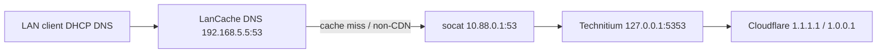

# DNS on ace (LanCache + Technitium)

Implementation: `nixos/containers/lancache.nix`, `nixos/containers/technitium.nix`, `nixos/containers/technitium-zones.nix`, `nixos/containers/technitium-sso.nix`, Caddy `nixos/caddy/technitium.nix`.

## Query path



1. **Clients** use DHCP DNS **192.168.5.5** (ace).
2. **LanCache DNS** answers hijacked game CDN names and forwards everything else upstream.
3. **Upstream** is **10.88.0.1:53** on the podman bridge — a host **socat** relay to **Technitium** on **127.0.0.1:5353** (not published on bond0).
4. **Technitium** serves **Primary** zones for `internal.prestonhager.com` and `prestonhager.com`, then recurses other names via forwarders **1.1.1.1** and **1.0.0.1**.

Ace itself keeps resolver **192.168.5.2** in `hosts/ace/default.nix` so the server does not loop through LanCache.

## Ports

| Service | Bind | Notes |
|---------|------|-------|
| LanCache DNS | `192.168.5.5:53` udp/tcp | House / game LAN DNS |
| Technitium DNS | `127.0.0.1:5353` udp/tcp | Upstream for LanCache only |
| Technitium UI | `127.0.0.1:5380` tcp | Caddy → `dns.prestonhager.com` |
| Technitium DoH backend | `127.0.0.1:8053` tcp | DNS-over-HTTP; Caddy terminates TLS |
| Technitium DoT | `:853` tcp | Native TLS (PFX from Caddy LE cert) |
| Caddy DoH / HTTP/3 | `:443` tcp + udp | `https://dns.prestonhager.com/dns-query` |
| Podman relay | `10.88.0.1:53` udp/tcp | Not routed from LAN; pod → Technitium |

Plain DNS on **192.168.5.5:53** (LanCache) is unchanged. Encrypted DNS is additive.

## Encrypted DNS (DoH, DoT, HTTP/3)

### Architecture

| Protocol | Termination | Backend | Client URL |
|----------|-------------|---------|------------|
| **DoH** | Caddy (Let's Encrypt via existing ace TLS) | Technitium DNS-over-HTTP on `127.0.0.1:8053` | `https://dns.prestonhager.com/dns-query` |
| **HTTP/3** | Caddy (`protocols h1 h2 h3`, UDP/443) | Same DoH path | Same URL (HTTP/3 when client supports QUIC) |
| **DoT** | Technitium native TLS | Technitium DNS TCP `:853` | `dns.prestonhager.com:853` |

Caddy handles DoH so TLS renewal stays centralized and HTTP/3 works without Technitium binding port 443. DoT uses Technitium's built-in listener; the LE certificate is exported from Caddy's on-disk cert store to PKCS#12 (`technitium-sync-tls-cert.service`) and applied via the Technitium API (`technitium-sync-protocols.service`).

Implementation: `nixos/caddy/technitium.nix`, `nixos/containers/technitium.nix`, `nixos/containers/technitium-protocols.nix`.

### Client configuration

| Client type | Setting |
|-------------|---------|
| DoH (browser, Android Private DNS, iOS profile) | `https://dns.prestonhager.com/dns-query` |
| DoT (Android, router, `systemd-resolved`) | `dns.prestonhager.com` port **853** |
| Plain DNS (unchanged) | `192.168.5.5` |

Recursion remains **AllowOnlyForPrivateNetworks** — LAN and RFC1918 clients get answers; public IPs may receive `REFUSED` unless you widen recursion in Technitium settings.

### Cloudflare DNS records

| Type | Name | Content | Proxy | Purpose |
|------|------|---------|-------|---------|
| A | `dns` | `192.168.5.5` | Proxied (orange) | DoH + web UI via Caddy :443 |

**DoT on port 853 does not traverse Cloudflare's HTTP proxy.** For encrypted DNS from the public Internet over DoT, add a **DNS-only** (grey cloud) record (e.g. `dot` → WAN IP) or connect over LAN/VPN to `192.168.5.5:853`. LAN clients resolving `dns.prestonhager.com` via Technitium split-horizon hit ace directly.

### Deploy encrypted DNS

After `nixos-rebuild switch --flake /etc/nixos#ace`:

```bash
systemctl status technitium-sync-tls-cert technitium-sync-protocols caddy
ss -tlnp | grep -E '8053|853|443'
```

## Storage

- LanCache: `/stor/lancache`
- Technitium config/logs: `/stor/technitium`, `/stor/technitium/logs`
- Zone sync hashes: `/stor/technitium/.internal-prestonhager-com-zone.sha256`, `/stor/technitium/.prestonhager-com-zone.sha256`

## Zones (Nix → Technitium API)

Authoritative records live in `nixos/containers/technitium-zones.nix` (`internalHosts`, `prestonhagerHosts`). `technitium-sync-zones.service` logs into the Technitium HTTP API and imports generated zone files (idempotent; re-runs when a zone file hash changes).

Technitium is configured with `DNS_SERVER_DOMAIN=internal.prestonhager.com` so the server does not default to `ip1.lc1.nm.us.prestonhager.com`-style automatic names. Do not recreate `lc1.nm.us` zones in Technitium.

### Zone: `internal.prestonhager.com`

| Host | Type | Target / IP |
|------|------|-------------|
| ace | A | 192.168.5.5 |
| crux | A | 192.168.5.6 |
| nova | A | 192.168.5.7 |
| grafana | A | 192.168.5.5 |
| cloud | A | 192.168.5.5 |
| dns | A | 192.168.5.5 |

### Zone: `prestonhager.com` (LAN only)

This zone overrides public Cloudflare answers for LAN clients using ace as DNS. The apex is not defined here (no `@` A/AAAA); only listed subdomains are authoritative on Technitium.

| Name | Type | Target |
|------|------|--------|
| ace | CNAME | ace.internal.prestonhager.com |
| crux | CNAME | crux.internal.prestonhager.com |
| nova | CNAME | nova.internal.prestonhager.com |
| grafana | CNAME | grafana.internal.prestonhager.com |
| cloud | CNAME | cloud.internal.prestonhager.com |
| dns | CNAME | dns.internal.prestonhager.com |
| ai, panel, test.panel, prometheus, jellyfin, vault, wg, metrics.wg, zitadel, git, matrix, spacetime, test.sui, faucet.test.sui, indexer.test.sui, factorio, game, lancache, mc, vpn | CNAME | ace.internal.prestonhager.com |
| crux.lc1.nm.us | CNAME | crux.internal.prestonhager.com |
| nova.lc1.nm.us | CNAME | nova.internal.prestonhager.com |

External Cloudflare CNAMEs (blog, github.io sites, dontgetgot, ACM validation, etc.) and apex **MX/TXT/SRV** records are copied into the Technitium zone unchanged so LAN clients still resolve them without NXDOMAIN from the partial primary zone.

### Cloudflare `ip1.lc1` → LAN mapping

Public Cloudflare CNAMEs that target `ip1.lc1.nm.us.prestonhager.com` (73.26.67.25) are overridden on LAN as follows:

| Public name | LAN target |
|-------------|------------|
| cloud, dns, grafana | matching `*.internal.prestonhager.com` A → 192.168.5.5 |
| ace, ai, factorio, faucet.test.sui, game, indexer.test.sui, jellyfin, lancache, matrix, mc, metrics.wg, panel, prometheus, spacetime, test.panel, test.sui, vault, vpn, wg, zitadel | ace.internal.prestonhager.com → 192.168.5.5 |
| crux.lc1.nm.us | crux.internal.prestonhager.com → 192.168.5.6 |
| nova.lc1.nm.us | nova.internal.prestonhager.com → 192.168.5.7 |

### Legacy `lc1.nm.us.prestonhager.com` → new names

Public DNS discovery (Cloudflare authoritative for `prestonhager.com`):

| Query | Result (public) |
|-------|-----------------|
| `prestonhager.com` NS | ivy.ns.cloudflare.com, felipe.ns.cloudflare.com |
| `prestonhager.com` A | 185.199.108–111.153 (GitHub Pages) |
| `crux.lc1.nm.us.prestonhager.com` A | 192.168.5.6 |
| `nova.lc1.nm.us.prestonhager.com` A | 192.168.5.7 |
| `ip1.lc1.nm.us.prestonhager.com` A | 73.26.67.25 |
| Other `*.lc1.nm.us.prestonhager.com` service names | No public A records observed |

LAN mapping (use these instead of `*.lc1.nm.us.prestonhager.com` when DHCP DNS is 192.168.5.5):

| Old / Wings / TLS pattern | Preferred LAN name | Resolves via |
|---------------------------|-------------------|--------------|
| `crux.lc1.nm.us.prestonhager.com` | `crux.prestonhager.com` | → crux.internal → 192.168.5.6 |
| `nova.lc1.nm.us.prestonhager.com` | `nova.prestonhager.com` | → nova.internal → 192.168.5.7 |
| `ip1.lc1.nm.us.prestonhager.com` (WAN) | `ace.prestonhager.com` | → ace.internal → 192.168.5.5 |
| Ace Caddy vhosts (`grafana.prestonhager.com`, etc.) | same short name under `prestonhager.com` | CNAME → ace.internal or matching `*.internal` |

Wings and public TLS may still reference `*.lc1.nm.us.prestonhager.com` in Cloudflare and `/etc/hosts` on nodes until migrated.

## Cloudflare DNS

Add a **proxied** record (same pattern as other ace Caddy apps):

| Type | Name | Content | Proxy |
|------|------|---------|-------|
| A | `dns` | `192.168.5.5` | Proxied (orange cloud) |

Public `prestonhager.com` records stay in Cloudflare; the Technitium zone is for split-horizon LAN resolution only.

## Local hosts (ace)

`nixos/local-service-hosts.nix` includes **`dns.prestonhager.com`** → `127.0.0.1` and internal names on LAN IPs. Apply with your usual `nixos-rebuild switch` on ace.

## DHCP (house / game LAN)

Set **primary DNS** to **192.168.5.5** on the router or DHCP scope.

## Technitium first run

1. Deploy config and `nixos-rebuild switch --flake /etc/nixos#ace`.
2. Confirm `systemctl status technitium-sync-zones` is **active (exited)**.
3. Open **https://dns.prestonhager.com** and sign in as **`admin`** (password in sops).
4. Confirm forwarders **1.1.1.1 / 1.0.0.1** under Settings if you use a pre-existing data dir.

## Zitadel SSO (web console)

Implementation: `nixos/containers/technitium-sso.nix`, secrets `nixos-secrets/secrets/containers/technitium.yaml` (`technitium-oidc-env`), Zitadel setup script `scripts/zitadel-technitium-setup.js`.

| Field | Value |
|-------|-------|
| Login URL | https://dns.prestonhager.com |
| SSO provider | Zitadel — https://zitadel.prestonhager.com |
| OIDC callback | https://dns.prestonhager.com/sso/callback |
| Zitadel app | **Technitium** (Home Lab project) |
| Admin role | Zitadel project role `technitium_admin` → Technitium group **Administrators** |

Secrets in `nixos-secrets/secrets/containers/technitium.yaml`:

```yaml
technitium-oidc-env: |
  TECHNITIUM_OIDC_CLIENT_ID=<from setup script>
  TECHNITIUM_OIDC_CLIENT_SECRET=<from setup script>
```

### Login flow

1. Open **https://dns.prestonhager.com**
2. Click **Login with SSO** (local `admin` password login remains for break-glass)
3. Authenticate at Zitadel as user **prestonh**
4. Technitium provisions/syncs the SSO user and maps `technitium_admin` → **Administrators** on each login

Direct SSO start (same as the button): Technitium redirects to Zitadel authorize with `redirect_uri=https://dns.prestonhager.com/sso/callback`.

### Automated setup (ace)

After pulling this repo to `/etc/nixos`:

```bash
# 1. Create Zitadel OIDC app + technitium_admin role + grant for prestonh
cd /etc/nixos
nix shell nixpkgs#nodejs_22 -c node scripts/zitadel-technitium-setup.js

# 2. Add printed client_id/secret to sops (see technitium.yaml.template)
cd /home/prestonh/nixos-secrets
sops secrets/containers/technitium.yaml   # add technitium-oidc-env block
git add secrets/containers/technitium.yaml && git commit -m "Add Technitium OIDC client credentials" && git push

# 3. Deploy
cd /etc/nixos
nix flake update nix-secrets
nixos-rebuild switch --flake /etc/nixos#ace

# 4. Apply SSO config to Technitium
systemctl restart technitium-sync-sso.service
curl -s http://127.0.0.1:5380/api/sso/status
```

`technitium-sync-sso.service` idempotently POSTs `/api/admin/sso/set` when OIDC secrets or desired settings change.

### MANUAL: Zitadel complement token action (required once)

Technitium reads **flat group names** from the OIDC `groups` claim. Zitadel project roles are nested under `urn:zitadel:iam:org:project:roles` unless you add a complement action.

1. Open https://zitadel.prestonhager.com/ui/console/org/actions
2. **New action** → name e.g. `technitium-flat-roles`
3. **Trigger**: Complement token — **Pre Userinfo creation** and **Pre access token creation**
4. Paste this script (from [Zitadel custom_roles example](https://github.com/zitadel/actions/blob/main/examples/custom_roles.js)):

```javascript
function flatRoles(ctx, api) {
  if (ctx.v1.user.grants == undefined || ctx.v1.user.grants.count == 0) {
    return;
  }
  let grants = [];
  ctx.v1.user.grants.grants.forEach(claim => {
    claim.roles.forEach(role => {
      grants.push(role);
    });
  });
  api.v1.claims.setClaim('groups', grants);
}
```

5. **Save** and attach the action to the org (or ensure it runs for all tokens)
6. In **Home Lab** → **Applications** → **Technitium**, confirm **Assert Roles on Authentication** (ID token + access token) is enabled (the setup script sets this via API)

Without this action, SSO login may succeed but group mapping fails and users get no Technitium permissions.

### How prestonh becomes Technitium admin

| Step | What |
|------|------|
| Zitadel | User **prestonh** receives project role **`technitium_admin`** on **Home Lab** (automated by `zitadel-technitium-setup.js`) |
| Token | Complement action puts `technitium_admin` in the `groups` claim |
| Technitium | Group map **`technitium_admin` → `Administrators`** (applied by `technitium-sync-sso.service`) |
| Login | On SSO sign-in, Technitium syncs membership to local group **Administrators** (full admin) |

Grant additional users: Zitadel console → **Home Lab** → **Authorizations** → grant **`technitium_admin`**.

### Verify SSO

```bash
# SSO enabled on Technitium
curl -s http://127.0.0.1:5380/api/sso/status

# Full SSO config (needs admin API token)
PASS=$(cat /stor/technitium/secrets/admin-password)
TOKEN=$(curl -sf -X POST http://127.0.0.1:5380/api/user/login \
  --data-urlencode user=admin --data-urlencode pass="$PASS" | jq -r .token)
curl -s -H "Authorization: Bearer $TOKEN" \
  'http://127.0.0.1:5380/api/admin/sso/get?includeGroups=true' | jq .

# Zitadel grant for prestonh
podman exec zitadel-db psql -U zitadel -d zitadel -c \
  "SELECT roles FROM projections.user_grants5 WHERE user_id=(SELECT id FROM projections.users14 WHERE username='prestonh');"

# UI: https://dns.prestonhager.com → Login with SSO → prestonh → Administration menu visible
systemctl status technitium-sync-sso
```

## Verify

```bash
# From a DHCP client using 192.168.5.5 as DNS
dig @192.168.5.5 ace.internal.prestonhager.com +short
dig @192.168.5.5 crux.prestonhager.com +short
dig @192.168.5.5 grafana.prestonhager.com +short

# On ace — Technitium directly
dig @127.0.0.1 -p 5353 crux.internal.prestonhager.com +short
dig @127.0.0.1 -p 5353 crux.prestonhager.com +short

# Relay from podman bridge
dig @10.88.0.1 ace.internal.prestonhager.com +short

# DoH (POST with wire-format DNS message — preferred by Technitium)
echo 'AAABAAABAAAAAAABBXRlY2huaXQAAAABAAEAACkQAAAAAAAATwAEAAEAAQAAAgABAAAB' | base64 -d > /tmp/q.bin
curl -sS -o /tmp/ans.bin -w '%{http_code}\n' \
  -X POST -H 'content-type: application/dns-message' -H 'accept: application/dns-message' \
  --data-binary @/tmp/q.bin https://dns.prestonhager.com/dns-query

# DoT (native Technitium TLS on :853)
echo | openssl s_client -connect dns.prestonhager.com:853 -servername dns.prestonhager.com 2>/dev/null \
  | openssl x509 -noout -subject -dates

# HTTP/3 (Caddy advertises QUIC on UDP/443)
curl --http3-only -sS -o /dev/null -w '%{http_version}\n' https://dns.prestonhager.com/
```

### Add a host later

1. **Preferred:** Edit `internalHosts` and/or `prestonhagerHosts` in `technitium-zones.nix`, bump the zone serial, run `nixos-rebuild switch --flake /etc/nixos#ace`. Delete the matching `/stor/technitium/.*-zone.sha256` file to force re-import without a serial bump.
2. **Ad hoc:** Technitium UI → Zones → edit record. UI changes may be overwritten on the next sync unless Nix is updated too.

### Reverse DNS (optional)

PTR for `192.168.5.0/24` is not managed in Nix today.

## Related

See also `docs/lancache-ace.md` for cache storage and HTTP ports.