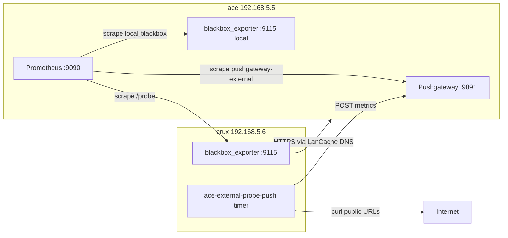

# Internal and external HTTP monitoring for Ace

Options for monitoring Ace services from **inside the LAN** (split-horizon DNS, LanCache) and from **outside** (public Internet).

Related: `docs/monitoring-ace.md`, `docs/dns-ace.md`.

## Architecture (implemented)



## Probe locations (labels)

| Label | Meaning | Source |
|-------|---------|--------|
| `local` | Ace host loopback / `/etc/hosts` path | `blackbox-http`, `blackbox-tcp` on ace |
| `lan` | LAN client path from crux via LanCache DNS | `blackbox-http-lan`, `blackbox-dns-lan` scraping crux `:9115` |
| `external` | Public DNS + WAN path | Pushgateway ← `scripts/ace-external-probe-push.sh` on crux |

Additional labels: `probe_source=crux` on LAN and external probes.

DNS split-horizon health on ace: `ace_dns_probe_success` from `lan-dns-prober` (`dig @192.168.5.5`).

---

## Part 1 — LAN: blackbox on crux

**crux** (`192.168.5.6`) runs `prometheus-blackbox-exporter` on `:9115` with LanCache DNS (`192.168.5.5`).

### HTTP targets (via LAN DNS)

- `https://grafana.prestonhager.com/`
- `https://cloud.prestonhager.com/`
- `https://zitadel.prestonhager.com/`
- `https://dns.prestonhager.com/`
- `https://matrix.prestonhager.com/`
- `http://192.168.5.5/` (loopback health, `http_local` module)

### DNS target

- `dig @192.168.5.5 grafana.prestonhager.com` → `192.168.5.5` (blackbox `dns_lan_grafana_prestonhager_com` module)

### NixOS files

| File | Host |
|------|------|
| `nixos/monitoring/crux-probes.nix` | crux — blackbox + external probe timer |
| `nixos/monitoring/crux-blackbox-config.nix` | crux blackbox modules |
| `hosts/crux/default.nix` | imports crux-probes, nameserver `192.168.5.5` |
| `nixos/monitoring/prometheus-config.nix` | ace — scrape jobs `blackbox-http-lan`, `blackbox-dns-lan` |

### Firewall

- **crux**: TCP `9115` from `192.168.5.5` (ace Prometheus)
- **ace**: TCP `9091` from `192.168.5.6` (crux push script)

---

## Part 2 — WAN: Pushgateway + external probe on crux

**ace** runs Pushgateway (`prom/pushgateway`) on host port **9091** (not exposed via Caddy).

**crux** runs `ace-external-probe-push` systemd timer every **5 minutes**:

- Resolves targets via public DNS (`1.1.1.1`)
- Curls HTTPS endpoints reachable from the Internet
- Pushes `probe_success`, `probe_duration_seconds`, `probe_http_status_code` to Pushgateway
- Labels: `probe_location=external`, `probe_source=crux`

### NixOS / scripts

| File | Role |
|------|------|
| `nixos/containers/pushgateway.nix` | ace Pushgateway container |
| `scripts/ace-external-probe-push.sh` | probe + push logic |
| `nixos/monitoring/crux-probes.nix` | crux timer + service |

Prometheus scrape job: **`pushgateway-external`** (`honor_labels: true`).

---

## Grafana

**Ace Service Uptime** (`ace-uptime.json`): template variable `probe_location` with values `local`, `lan`, `external`.

- LAN row: crux blackbox metrics
- External row: pushgateway metrics
- DNS row: `ace_dns_probe_success` (ace-side LanCache check)

Dashboard URLs (on ace Grafana):

- `/d/ace-uptime` — combined uptime
- `/d/ace-http-probes` — local blackbox HTTP detail
- `/d/ace-tcp-probes` — local TCP probes

---

## Deploy

### ace

```bash
git pull
sudo nixos-rebuild switch --flake /etc/nixos#ace
systemctl status lan-dns-prober.timer
curl -s http://127.0.0.1:9091/metrics | head
```

### crux

```bash
git pull
sudo nixos-rebuild switch --flake /etc/nixos#crux
systemctl status prometheus-blackbox-exporter ace-external-probe-push.timer
curl -s http://127.0.0.1:9115/metrics | head
```

### Verify in Prometheus

```promql
probe_success{probe_location="lan"}
probe_success{probe_location="external"}
probe_success{probe_location="local"}
ace_dns_probe_success
```

---

## Manual configuration

### Public probe targets

Edit `DEFAULT_TARGETS` in `scripts/ace-external-probe-push.sh` or set on crux:

```bash
EXTERNAL_PROBE_TARGETS="https://dns.prestonhager.com/,https://grafana.prestonhager.com/"
```

Most ace vhosts are **LAN-only** (Technitium split-horizon). Only Cloudflare-proxied or port-forwarded names on `73.26.67.25` are meaningful for external monitors. Trim the default list to match what is actually reachable from the Internet.

### Optional: UptimeRobot / VPS

For redundancy, run the same script from a VPS or use [UptimeRobot](https://uptimerobot.com/) free tier (5 min interval) for alerting. Point pushes at `http://192.168.5.5:9091` only from trusted LAN/VPN sources.

### Optional: extra LAN HTTP targets on crux

Add hostnames to `lanHttpHosts` in `nixos/monitoring/crux-blackbox-config.nix` and mirror in `lanHttpStaticConfigs` via prometheus-config (auto from same list).

---

## Security notes

- Pushgateway accepts pushes on LAN port **9091**; firewall restricts to crux (`192.168.5.6`) only.
- Do not expose Pushgateway or blackbox ports through Cloudflare or WAN.
- External probe metrics use grouping key `job=external-http-probe`, `instance=crux`.

---

## Comparison (reference)

| Option | Cost | Interval | Effort | Prometheus-native |
|--------|------|----------|--------|-------------------|
| Crux blackbox (implemented) | Free | 15s | Medium | Yes |
| Ace loopback blackbox (implemented) | Free | 15s | Low | Yes |
| Crux pushgateway WAN probes (implemented) | Free | 5 min | Low | Yes |
| UptimeRobot | Free | 5 min | Low | Via bridge |
| VPS blackbox + Pushgateway | Free | 1–5 min | Medium | Yes |
