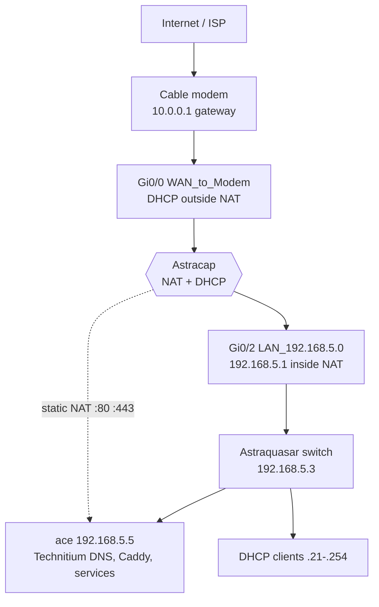

# Astracap (Cisco 2911 router)

LAN gateway and edge router for `192.168.5.0/24`. Documented from live IOS **15.7(3)M8** (`show running-config`, interface/route/NAT/DHCP/CDP output via SSH, June 2026). Secrets are omitted; only configuration intent is recorded.

SSH access: [Network & SSH / Bitwarden](./network-ssh.md). Homelab overview: [Network topology](network-topology.md).

## Role

| Function | Detail |
|----------|--------|
| Default gateway | `192.168.5.1` on LAN |
| WAN | `GigabitEthernet0/0` — DHCP from ISP modem (`10.0.0.0/24` observed) |
| LAN | `GigabitEthernet0/2` — `192.168.5.1/24`, NAT inside |
| DHCP server | Pool **LAN-Pool** for `192.168.5.0/24` |
| DNS for clients | DHCP option: **192.168.5.5** (Technitium on ace), fallback **1.1.1.1** |
| NAT | PAT (overload) for all LAN hosts; static TCP **80/443** to **192.168.5.5** (ace) |
| Management | SSH (publickey only for `prestonh`); VTY restricted by ACL 1 (LAN only) |

## Logical diagram

## Interfaces

| Interface | Description | IP | NAT | Status (typical) |
|-----------|-------------|-----|-----|------------------|
| `GigabitEthernet0/0` | WAN_to_Modem | DHCP (e.g. `10.0.0.145`) | outside | up |
| `GigabitEthernet0/2` | LAN_192.168.5.0 | `192.168.5.1/24` static | inside | up |
| `GigabitEthernet0/1` | — | unassigned | — | admin down |
| `GigabitEthernet0/0/0` | — | unassigned | — | admin down |
| `Embedded-Service-Engine0/0` | — | unassigned | — | admin down |

Default route: **`0.0.0.0/0` via DHCP** on WAN (learned gateway `10.0.0.1`).

## DHCP

| Setting | Value |
|---------|--------|
| Pool name | `LAN-Pool` |
| Network | `192.168.5.0 /255.255.255.0` |
| Excluded | `192.168.5.1`–`192.168.5.20` (infrastructure / static range) — **DHCP pool floor is `.21`** |
| Default router | `192.168.5.1` |
| Domain name | `home.internal` |
| DNS servers | `192.168.5.5`, `1.1.1.1` |
| Lease | 7 days |

Static examples in the excluded range: ace `.5`, crux `.6`, nova `.7`, elara `.8`, zenith `.9`, **ace iDRAC `.10`**, **mars iDRAC `.11`**, sally iDRAC `.12`, mars `.15`, sally `.16` (see [network-topology.md](network-topology.md)).

Clients should use **Technitium on ace** (`192.168.5.5`) as primary DNS; see [DNS on ace](./dns.md).

Router IOS also has **`ip name-server 192.168.5.2`** and **`192.168.5.5`** and **`ip dns server`** enabled (router can answer/cache DNS for its own lookups).

## NAT and firewall

| Rule | Purpose |
|------|---------|
| `access-list 1` | Permits `192.168.5.0/24` (used for NAT source and VTY inbound filter) |
| Dynamic NAT | `ip nat inside source list 1 interface Gi0/0 overload` — all LAN → WAN PAT |
| Static NAT | TCP **80** and **443** on WAN interface → **192.168.5.5:80/443** (published web/TLS on ace) |

No extended ACLs on data-plane interfaces in the documented config; edge filtering is primarily NAT + VTY `access-class 1`.

## Physical / CDP

| Local | Remote | Notes |
|-------|--------|-------|
| `GigabitEthernet0/2` | Astraquasar `GigabitEthernet2/0/1` | Only CDP neighbor; switch at `192.168.5.3` |

## Management and authentication

| Item | Configuration |
|------|----------------|
| Hostname | `Astracap` |
| AAA | `aaa authentication login LOCAL-USERS local` |
| Privileged user | `prestonh` privilege 15 ([REDACTED] password secret) |
| Enable | [REDACTED] secret/password configured |
| SSH | Version 2; **publickey-only** authentication; authorized key for `prestonh` via `ip ssh pubkey-chain` ([REDACTED]) |
| VTY | `transport input ssh`; `access-class 1 in`; login via LOCAL-USERS |

Console/AUX lines use default-style settings; no remote telnet on VTY.

## Hardware / software

- **Model:** CISCO2911/K9 (4× GE + 1× channelized T1/E1 port)
- **IOS:** 15.7(3)M8
- **Licenses:** ipbasek9 permanent; security/UC/data packages not active

## Operational notes

- WAN address is **DHCP**; public services rely on ISP forwarding or CNAME to **`ip1.lc1.nm.us.prestonhager.com`** (`73.26.67.25`) hitting static NAT on ace.
- Re-fetch config: `ssh astracap` then `enable` → `show running-config` (do not paste secrets into git).
- Switch documentation: [Astraquasar](./network-astraquasar.md).
