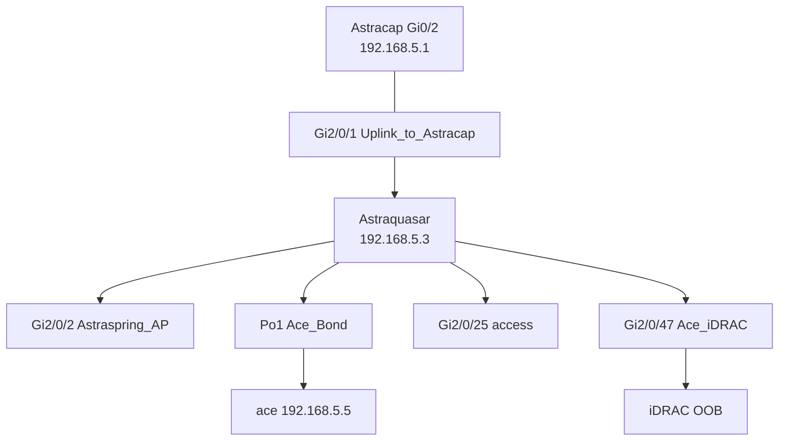

# Astraquasar (Cisco Catalyst 3650 switch)

Layer-2 access switch for the homelab LAN (`192.168.5.0/24`). Documented from live IOS-XE **16.12.7** on **WS-C3650-48PD** (`show running-config`, VLAN/interface/STP/CDP output via SSH, June 2026). Secrets omitted.

SSH: [Network & SSH / Bitwarden](network-ssh-ace.md). Router: [Astracap](network-astracap-router.md). Full map: [Network topology](network-topology.md).

## Role

| Function | Detail |
|----------|--------|
| LAN switching | Single VLAN (**VLAN 1** / default) — flat L2 domain |
| Management | SVI **`Vlan1` → `192.168.5.3/24`**, default gateway **`192.168.5.1`** (Astracap) |
| Uplink | **`Gi2/0/1`** to Astracap **`Gi0/2`** (CDP confirms) |
| Server attachment | **ace** — LACP **Port-channel1** (`Gi2/0/13`–`16`, access VLAN 1) |
| Wi‑Fi | **`Gi2/0/2`** — Astraspring access point |

## Logical diagram

## VLANs

| VLAN | Name | Ports | Notes |
|------|------|-------|-------|
| 1 | default | All access ports listed in `show vlan brief` | No additional user VLANs configured |

All documented access ports use **`switchport mode access`** (no 802.1Q trunks in use on active uplink).

## Port assignments (labeled / notable)

| Port | Description / config | Status (June 2026) | Notes |
|------|----------------------|--------------------|-------|
| `Gi2/0/1` | Uplink_to_Astracap | connected | Primary router uplink |
| `Gi2/0/2` | Astraspring_AP, portfast | connected | AP + wireless clients (multiple MACs) |
| `Gi2/0/3` | access | notconnect | Spare |
| `Gi2/0/4`–`12`, `17`–`24`, `26`, `28`–`46`, `48` | — | shutdown or disabled | Intentionally unused |
| `Gi2/0/13`–`16` | Server_Ace → **Po1** LACP active, portfast | 14 connected; 13 suspended; 15–16 notconnect | ace bond members |
| `Po1` | Ace_Bond | connected (via active member) | Aggregates ace NICs |
| `Gi2/0/25` | access | connected | Host present (dynamic MAC); **crux/nova not confirmed by label** |
| `Gi2/0/27` | access | notconnect | Spare |
| `Gi2/0/47` | **Ace_iDRAC** — access VLAN 1, portfast (**no** port-security) | connected (Jul 2026) | Dedicated Dell iDRAC OOB NIC — MAC `18:66:DA:82:52:D6`, static **`192.168.5.10`**. Sticky port-security cleared 2026-07-12. Runbook: [ace-idrac.md](ace-idrac.md). |
| `Te2/1/4` | Uplink_to_Astracap (routed, no IP) | shutdown | Alternate uplink not in use |
| `Gi2/1/1`, `Gi2/1/2`, `Te2/1/3` | default | — | Unused uplink capacity |

**crux** (`192.168.5.6`) and **nova** (`192.168.5.7`) are documented NixOS nodes in repo SSH config but **no switch port descriptions** name them; they may use `Gi2/0/25`, another switch, or were offline during documentation. Confirm with `show mac address-table` and host NIC labels.

## Spanning tree

- Mode: **rapid-PVST**
- **`spanning-tree portfast`** on AP and ace bond member ports
- UplinkFast disabled (default)

## Routing

- **L3 routing not used** for production traffic (SVI + default gateway only).
- **`ip default-gateway 192.168.5.1`**

## CDP

| Local | Remote |
|-------|--------|
| `GigabitEthernet2/0/1` | Astracap `GigabitEthernet0/2` (`192.168.5.1`) |

## Management and authentication

| Item | Configuration |
|------|----------------|
| Hostname | `Astraquasar` |
| User | `admin` privilege 15, `login local` on VTY |
| Enable | [REDACTED] |
| VTY | `transport input ssh`; `login local` ([REDACTED] type-7 password on line — not documented) |
| SSH | Version 2; pubkey for `admin` via `ip ssh pubkey-chain` ([REDACTED]) |
| HTTP(S) | Enabled (`ip http server`, `ip http secure-server`) for Web UI — prefer SSH |

## Hardware

- **WS-C3650-48PD** — 48× PoE GE + 2× GE + 2× 10G
- **Smart Licensing:** eval expired / unregistered (operational; register if Cisco support needed)

## Operational notes

- ace should stay on **Po1** for throughput; only one member was forwarding at documentation time — check LACP on ace if performance issues.
- Fetch fresh data: `ssh astraquasar` → `show interfaces status`, `show etherchannel summary`.
