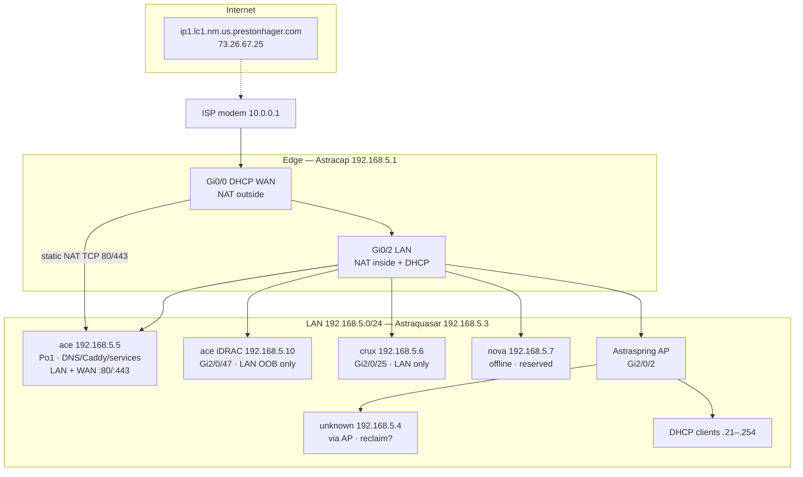
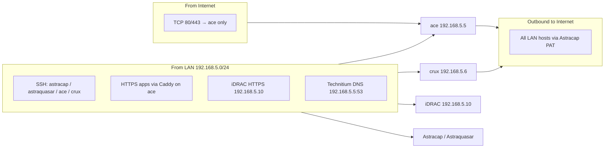
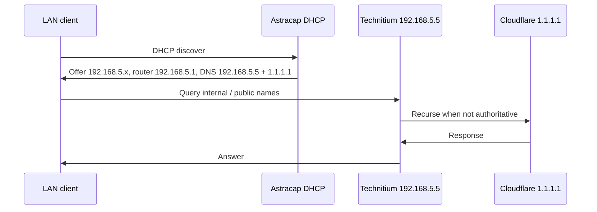

# Homelab network topology

End-to-end view of the **192.168.5.0/24** LAN: ISP edge through Astracap, Astraquasar, ace services (including Technitium DNS), and game/Pterodactyl nodes.

**Verified live** (Aug 2026): Astracap + Astraquasar SSH, ace ARP/neighbors, crux MAC on `Gi2/0/25`. Re-check before adding static devices in `.1`–`.20`.

## Hosts, IPs, and where they are reachable from

| Host / device | IP | Switch port | LAN reachability | Internet / WAN | Notes |
|---------------|-----|-------------|------------------|----------------|-------|
| Astracap (router) | `192.168.5.1` | Astraquasar `Gi2/0/1` (uplink) | LAN SSH `astracap` (`prestonh`) | WAN on `Gi0/0` (DHCP `10.0.0.x`); management VTY is **LAN-only** (ACL 1) | Default gateway + DHCP |
| *(legacy name-server)* | `192.168.5.2` | — | **Down** (Aug 2026) | — | Still listed on router `ip name-server`; unused |
| Astraquasar (switch) | `192.168.5.3` | SVI VLAN 1 | LAN SSH `astraquasar` (`admin`) | No WAN publish | L2 only |
| **Unknown** (wireless) | `192.168.5.4` | via Astraspring `Gi2/0/2` | Pingable on LAN | PAT outbound only | MAC `94:83:c4:42:34:03`; **occupies reserved static range** — identify or reclaim before assigning `.4` |
| **ace** | `192.168.5.5` | `Po1` (`Gi2/0/13`–`16`) | Full LAN; SSH `ace` (root) | **WAN TCP 80/443** static NAT → ace; public name `ip1.lc1.nm.us.prestonhager.com` (`73.26.67.25`) | DNS, Caddy, monitoring, apps |
| **crux** | `192.168.5.6` | **`Gi2/0/25`** (MAC `b8:85:84:a8:6d:b4`) | LAN SSH `crux` (root); no WAN NAT | Outbound PAT only | Pterodactyl Wings; ports: [crux-ports.md](crux-ports.md) |
| **nova** | `192.168.5.7` | *unassigned / offline* | **Down** (Aug 2026) | No WAN NAT | Planned Wings node; reserve IP until reattached |
| **ace iDRAC** | `192.168.5.10` | `Gi2/0/47` | LAN HTTPS/Redfish only (`https://192.168.5.10`) | No WAN publish | OOB; [ace-idrac.md](ace-idrac.md) |
| Astraspring AP | (bridged) | `Gi2/0/2` | Wi-Fi clients join same L2 LAN | Client traffic via Astracap PAT | Not a routed hop |
| DHCP clients | `192.168.5.21`–`.254` | AP and spare access ports | LAN only (unless you add NAT) | Outbound PAT | Active leases vary; see Astracap `show ip dhcp binding` |
| **ph-nixos** / admin PCs | DHCP or static in pool | — | LAN SSH to infra hosts | Outbound PAT | SSH aliases in home-manager |

### Access cheat-sheet

```text
Internet ──► ISP modem (10.0.0.1)
               │
               ▼
         Astracap Gi0/0 (WAN / NAT outside)
               │  static NAT :80/:443 ──► ace only
               │  PAT (all LAN outbound)
               ▼
         Astracap Gi0/2 192.168.5.1
               │
               ▼
         Astraquasar 192.168.5.3 (VLAN 1 flat L2)
           ├─ Po1        → ace          192.168.5.5   [LAN + WAN :80/:443]
           ├─ Gi2/0/47   → ace iDRAC    192.168.5.10  [LAN OOB only]
           ├─ Gi2/0/25   → crux         192.168.5.6   [LAN only]
           ├─ (none)     → nova         192.168.5.7   [offline]
           ├─ Gi2/0/2    → Astraspring + Wi-Fi clients
           └─ DHCP .21+  → workstations / phones / etc.
```

**Rule of thumb when adding a device**

1. Pick a free IP in **`192.168.5.1`–`.20`** for infrastructure (static), or let DHCP assign **`.21`–`.254`**.
2. Document it in this table + [Astraquasar port table](network-astraquasar-switch.md) (and label the switch port).
3. WAN publish is **opt-in**: only ace has static NAT today. Anything else stays LAN-only unless you add NAT on Astracap.
4. Free / reclaim **`.2`**, **`.4`**, and **`.7`** (or confirm ownership) before reusing those addresses.

## Full topology



## Accessibility zones



## DNS flow

Technitium on **ace** is primary LAN DNS (LanCache deprecated).



Details: [DNS on ace](dns-ace.md).

## Addressing summary

| Address | Device / service |
|---------|------------------|
| `192.168.5.1` | Astracap — default gateway, DHCP server |
| `192.168.5.2` | Router `ip name-server` leftover — **host down** (Aug 2026) |
| `192.168.5.3` | Astraquasar — switch management |
| `192.168.5.4` | **Unidentified** wireless client (via AP) — reserved-range collision risk |
| `192.168.5.5` | ace — static; primary DNS, reverse proxy, monitoring |
| `192.168.5.6` | crux — static; Astraquasar **`Gi2/0/25`** |
| `192.168.5.7` | nova — static reserved; **offline** (Aug 2026) |
| `192.168.5.10` | ace iDRAC — static OOB (`18:66:DA:82:52:D6`, Gi2/0/47); see [ace-idrac.md](ace-idrac.md) |
| `192.168.5.1`–`.20` | Static / infrastructure (DHCP excluded); pool floor **`.21`** |
| `192.168.5.21`–`.254` | DHCP pool (Astracap `LAN-Pool`) |
| `10.0.0.x` | WAN side DHCP on Astracap Gi0/0 |

## NAT / published services

| WAN (on Gi0/0) | Inside target | Purpose |
|----------------|---------------|---------|
| TCP 80 | `192.168.5.5:80` | HTTP to ace (Caddy / services) |
| TCP 443 | `192.168.5.5:443` | HTTPS to ace |
| Other outbound | PAT via Gi0/0 | All LAN hosts |

No static WAN NAT to **crux** or **nova** as of Aug 2026. Crux listening ports and probe coverage: [crux-ports.md](crux-ports.md). Grafana: [Network Topology & Ports](https://grafana.prestonhager.com/d/network-topology).

## SSH and documentation index

| Topic | Document |
|-------|----------|
| SSH keys, Bitwarden, legacy KEX | [network-ssh-ace.md](network-ssh-ace.md) |
| Router config | [network-astracap-router.md](network-astracap-router.md) |
| Switch config | [network-astraquasar-switch.md](network-astraquasar-switch.md) |
| DNS | [dns-ace.md](dns-ace.md) |

## Workstation access

**ph-nixos** and other admin systems on LAN use the same gateway and DNS path; SSH aliases for infrastructure are defined in home-manager (`users/prestonh/programs/ssh.nix`).
