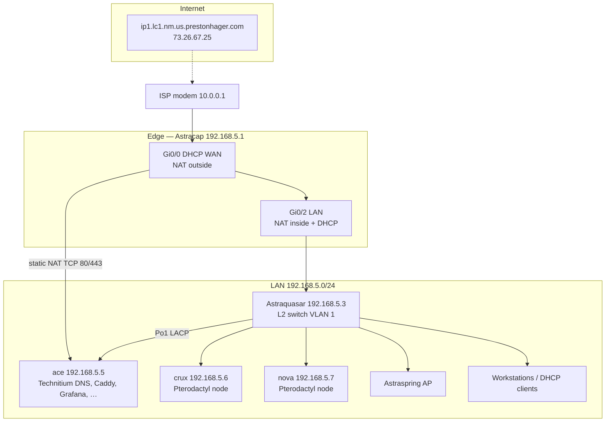
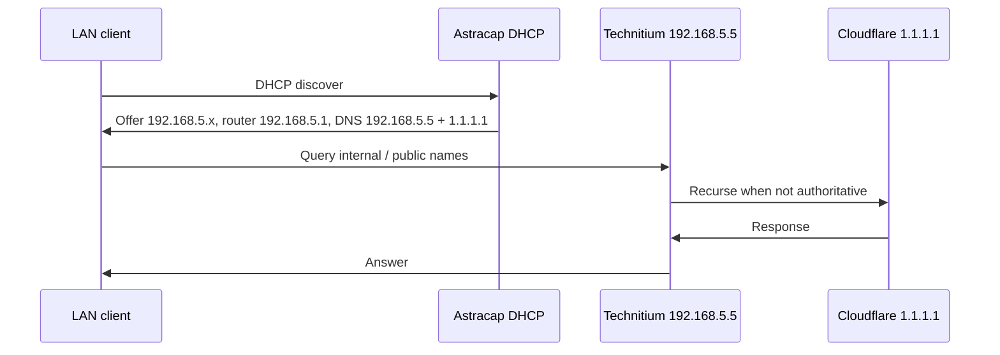

# Homelab network topology

End-to-end view of the **192.168.5.0/24** LAN: ISP edge through Astracap, Astraquasar, ace services (including Technitium DNS), and game/Pterodactyl nodes. Based on live Cisco configs (June 2026) and repo host definitions.

## Full topology

Solid lines are observed switch/router attachments; **crux/nova** switch ports are inferred from IP planning (see [Astraquasar port table](network-astraquasar-switch.md)).

## DNS flow

Technitium on **ace** is primary LAN DNS (LanCache deprecated).

Details: [DNS on ace](dns-ace.md).

## Addressing summary

| Address | Device / service |
|---------|------------------|
| `192.168.5.1` | Astracap — default gateway, DHCP server |
| `192.168.5.2` | Referenced on router as `ip name-server` (legacy/secondary; role not verified) |
| `192.168.5.3` | Astraquasar — switch management |
| `192.168.5.5` | ace — static; primary DNS, reverse proxy, monitoring |
| `192.168.5.6` | crux — static (repo) |
| `192.168.5.7` | nova — static (repo) |
| `192.168.5.21`–`.254` | DHCP pool (`.1`–`.20` excluded) |
| `10.0.0.x` | WAN side DHCP on Astracap Gi0/0 |

## NAT / published services

| WAN (on Gi0/0) | Inside target | Purpose |
|----------------|---------------|---------|
| TCP 80 | `192.168.5.5:80` | HTTP to ace (Caddy / services) |
| TCP 443 | `192.168.5.5:443` | HTTPS to ace |
| Other outbound | PAT via Gi0/0 | All LAN hosts |

## SSH and documentation index

| Topic | Document |
|-------|----------|
| SSH keys, Bitwarden, legacy KEX | [network-ssh-ace.md](network-ssh-ace.md) |
| Router config | [network-astracap-router.md](network-astracap-router.md) |
| Switch config | [network-astraquasar-switch.md](network-astraquasar-switch.md) |
| DNS | [dns-ace.md](dns-ace.md) |

## Workstation access

**ph-nixos** and other admin systems on LAN use the same gateway and DNS path; SSH aliases for infrastructure are defined in home-manager (`users/prestonh/programs/ssh.nix`).
