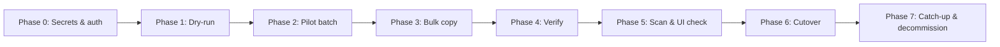

# Nextcloud Cloud Migration Plan — iCloud & OneDrive

**Status:** Planning only (implementation is separate agents)  
**Updated:** 2026-06-27  
**Branch:** `dell-poweredge-r730xd`  
**Related:** [Nextcloud on ace](./nextcloud-ace.md), [Nextcloud Action Plan](./nextcloud-action-plan.md), `nixos/containers/nextcloud.nix`

---

## 1. Goals

### Primary objective

Perform a **controlled one-time migration** of personal files and photos from **Apple iCloud** and **Microsoft OneDrive** into the self-hosted Nextcloud instance on **ace** (`https://cloud.prestonhager.com`), then cut over daily use to Nextcloud (Desktop/Mobile clients) and **decommission** reliance on the cloud providers for file storage.

### Scope

| Source | Files (documents, etc.) | Photos |
|--------|-------------------------|--------|
| iCloud | iCloud Drive | iCloud Photos library |
| OneDrive | OneDrive root / Documents | OneDrive `Pictures` / Camera Roll folders |

### Migration vs ongoing sync

| Mode | When | Tooling |
|------|------|---------|
| **One-time bulk migration** | Initial cutover window | `rclone copy`, `icloudpd`, `occ files:scan` |
| **Incremental catch-up** | 1–4 weeks after bulk (users still adding to old clouds) | `rclone copy` (idempotent), optional second `icloudpd` pass |
| **Ongoing sync** | **Not in scope** for cloud→Nextcloud | Use **Nextcloud Desktop/Mobile** clients post-cutover; do **not** run `rclone bisync` or `sync` against iCloud/OneDrive long-term |

**Rationale:** Bidirectional or “mirror” sync (`rclone sync`, `bisync`) risks deleting data on either side and adds operational burden. The goal is to **copy once, verify, switch clients**, then let Nextcloud be the system of record.

### Non-goals (initial phases)

- Migrating iCloud Mail, Contacts, or Calendar (separate apps / CardDAV already on Nextcloud if needed later)
- Migrating shared/collaborative OneDrive links or SharePoint document libraries
- Real-time two-way sync between iCloud/OneDrive and Nextcloud after cutover
- Migrating other users beyond those with Zitadel SSO accounts on ace

### Success criteria

- All targeted files and photos present in Nextcloud with correct paths (see §6)
- Spot-check verification passes (counts, checksums, sample opens in Photos/Files UI)
- `occ files:scan` reports no missing entries for migrated paths
- Source clouds can be read-only or cancelled without data loss on Nextcloud

---

## 2. Technology stack comparison

### 2.1 rclone (iCloud Drive, OneDrive, WebDAV→Nextcloud)

| Aspect | Detail |
|--------|--------|
| **Backends** | `iclouddrive` (Drive only), `onedrive` (personal & business), `webdav` (Nextcloud destination) |
| **Pros** | Mature, resumable transfers, `--dry-run`, bandwidth limits, checksum verification (`--checksum`), single config file, well-packaged in nixpkgs |
| **Cons** | **Does not** access iCloud Photos library; iCloud Drive auth is cookie/app-password based and can break on Apple policy changes; OneDrive throttling on large libraries |
| **OAuth / auth** | **OneDrive:** `rclone config` → `onedrive` → browser OAuth; refresh token stored in `rclone.conf`. **iCloud Drive:** Apple ID + app-specific password (or session cookie after 2FA); no standard OAuth. **Nextcloud WebDAV:** app password or OIDC-backed user + app token |
| **Verdict** | **Selected** for iCloud Drive files, all OneDrive content (files + photos in Drive), and optional WebDAV upload path |

### 2.2 icloudpd (iCloud Photos)

| Aspect | Detail |
|--------|--------|
| **Purpose** | Download iCloud Photo Library to local disk |
| **Pros** | Albums, Live Photos (`.HEIC` + `.MOV`), incremental sync, 2FA support, `--dry-run`, folder-per-album mode |
| **Cons** | Photos only (not Drive); separate auth/session from rclone; slower for very large libraries |
| **Auth** | Interactive login (first run) stores session in a state directory; supports app-specific password for 2FA accounts |
| **Verdict** | **Selected** for iCloud Photos (rclone cannot replace this) |

### 2.3 rclone: `copy` vs `sync` vs `bisync`

| Command | Behavior | Migration fit |
|---------|----------|---------------|
| **`copy`** | Copy new/changed files **to** destination; never deletes on either side | **Recommended** for all migration and catch-up passes |
| **`sync`** | Makes destination identical to source; **deletes** extra files on destination | **Reject** — too destructive during migration |
| **`bisync`** | Two-way sync with resolvers | **Reject** for cloud→Nextcloud — only consider post-cutover Nextcloud↔local edge cases via Desktop client, not rclone |

Use `copy` with `--update` or `--checksum` for incremental catch-up. Keep `--dry-run` / `-i` in planning scripts until verified.

### 2.4 Nextcloud ingestion paths

| Method | Pros | Cons | Verdict |
|--------|------|------|---------|
| **WebDAV API** (`rclone` → `nextcloud:` remote) | Goes through Nextcloud; works remotely; correct metadata | Slower for multi-TB; PHP upload limits (mitigated: ace allows 128G upload) | Good for **dry-run / small batches / off-ace** runs |
| **Direct data dir** (`/stor/nextcloud/data/<user>/files/…`) + **`occ files:scan`** | Fastest on ace; no HTTP overhead | Must preserve `www-data` ownership; bypasses some app hooks until scan | **Preferred on ace** for bulk migration |
| **Nextcloud Desktop** | User-friendly ongoing sync | Poor for initial bulk/TB-scale server-side migration | **Post-cutover** user clients only |
| **`occ files:scan`** | Required after direct filesystem writes | Does not transfer data | **Required** after direct writes |

Scan command (on ace):

```bash
podman exec -u www-data nextcloud php /var/www/html/occ files:scan --path="<user>/files/Migrated" <user>
```

### 2.5 Orchestration: Python vs shell vs Nix

| Approach | Pros | Cons | Verdict |
|----------|------|------|---------|
| **Pure shell** | Matches many `scripts/ace-*.sh` deploy helpers | Harder CLI subcommands, status aggregation | Use for thin wrappers per provider |
| **Python CLI** | `argparse` subcommands, JSON status, exit codes; matches `scripts/astracap-*.py` | Extra dependency (stdlib + subprocess sufficient) | **Selected** for main `migrate` entrypoint |
| **Nix package** | Reproducible tool closure on ace | Overhead for a script-heavy tool | **Optional** `packages.nextcloud-migrate` wrapping Python + rclone + icloudpd |

---

## 3. Recommended architecture

### Selected stack

```
┌─────────────────┐     rclone copy      ┌──────────────────────────────┐
│ iCloud Drive    │ ───────────────────► │                              │
└─────────────────┘                      │  ace: /stor/nextcloud/data/  │
┌─────────────────┐     icloudpd         │  <user>/files/Migrated/…     │
│ iCloud Photos   │ ───────────────────► │                              │
└─────────────────┘                      │  + occ files:scan            │
┌─────────────────┐     rclone copy      │                              │
│ OneDrive        │ ───────────────────► └──────────────────────────────┘
│ (files+photos)  │                              │
└─────────────────┘                              ▼
                                         Nextcloud 31 (Photos + Files)
                                         https://cloud.prestonhager.com
```

| Layer | Choice |
|-------|--------|
| iCloud Drive files | **rclone** (`iclouddrive` → local staging or direct data path) |
| iCloud Photos | **icloudpd** → `Migrated/iCloud/Photos/` |
| OneDrive (files + photos) | **rclone** (`onedrive` → `Migrated/OneDrive/`) |
| Transfer mode | **`rclone copy`** (+ `--checksum` on verification pass) |
| Nextcloud indexing | **Direct write on ace** + **`occ files:scan`** (WebDAV fallback) |
| Orchestration | **Python CLI** in `scripts/nextcloud-migrate/` |
| Runtime | **ace** (same host as `/stor/nextcloud`; SSH or local) |
| Secrets | **sops-nix** + **Bitwarden** (see §4) |

### Why not alternatives

- **Nextcloud Desktop-only migration:** Requires user workstation online for TB-scale data; no centralized logging on ace.
- **rclone bisync / sync:** Deletion risk; wrong model for “leave the cloud.”
- **rclone for iCloud Photos:** Backend does not exist; icloudpd is the standard tool.
- **Third-party SaaS migrators:** Cost, privacy, and less control vs self-hosted tooling already in Nix.

### Execution host

Run migration **on ace** (or via SSH to ace) so copies can target `/stor/nextcloud/data/` directly. Avoid pulling multi-TB over LAN twice (cloud→laptop→ace).

---

## 4. Auth and credentials

**Never commit tokens, passwords, or `rclone.conf` to git.**

### Secret storage matrix

| Secret | Store in | Notes |
|--------|----------|-------|
| Apple ID app-specific password | Bitwarden + sops `nextcloud-migrate-env` | Used by rclone icloud + icloudpd |
| icloudpd session / cookie dir | `/run/nextcloud-migrate/icloudpd/` (tmpfiles) or `/var/lib/nextcloud-migrate/icloudpd/` | Mode `0700`; not in git |
| rclone.conf (OneDrive OAuth refresh, remote defs) | sops secret `nextcloud-migrate-rclone.conf` → deployed to `/run/nextcloud-migrate/rclone.conf` | `chmod 600`; template in nix-secrets |
| Nextcloud app password (WebDAV) | Bitwarden + sops | Per migrated user; label `nextcloud-migrate-<user>` |
| OneDrive OAuth client (if custom) | Usually unnecessary — rclone built-in client | Document redirect URL if using custom Azure app |

### sops-nix integration (future implementation)

Add to `nixos-secrets/secrets/containers/nextcloud.yaml` (or dedicated `nextcloud-migrate.yaml`):

```yaml
nextcloud-migrate-env: |
  ICLOUD_APP_PASSWORD=...
  # optional per-user Nextcloud app passwords for WebDAV fallback

nextcloud-migrate-rclone.conf: |
  # encrypted rclone.conf blob (sops file type)
```

On ace, a `nextcloud-migrate-env.service` (oneshot) materializes secrets under `/run/nextcloud-migrate/` after `sops-nix.service`, similar to `nextcloud-container-env.service`.

### OAuth flows (operator runbook)

**OneDrive (first-time):**

```bash
export RCLONE_CONFIG=/run/nextcloud-migrate/rclone.conf
rclone config reconnect onedrive:
# Browser opens; sign in with Microsoft account; token saved to rclone.conf
# Re-encrypt updated rclone.conf back into sops (manual script)
```

**iCloud Drive (rclone):**

```bash
rclone config create icloud iclouddrive apple_id prestonhager@icloud.com password "$ICLOUD_APP_PASSWORD"
```

**icloudpd (first-time):**

```bash
icloudpd --username prestonhager@icloud.com --auth-only
# 2FA prompt; session stored in --cookie-directory
```

### Bitwarden

Use Bitwarden (or Vaultwarden MCP) as the **human source of truth** for app passwords and OAuth setup notes. sops holds what ace needs at runtime; Bitwarden holds rotation history and recovery.

---

## 5. Photo handling

### Formats

| Format | Source | Handling |
|--------|--------|------------|
| **HEIC/HEIF** | iCloud Photos, iPhone | Nextcloud 31 previews HEIC via Imaginary/GD; enable Preview Generator if thumbnails slow. Optional batch convert to JPEG **only** if clients lack HEIC support — default **keep originals**. |
| **Live Photos** | iCloud | icloudpd downloads `.HEIC` + `.MOV` pairs; keep both in same folder; Nextcloud shows still; `.MOV` available as video |
| **JPEG/PNG** | OneDrive, exported iCloud | Copy as-is |
| **RAW** | If present in OneDrive | Copy as-is; may need Preview Generator for thumbnails |
| **MP4/MOV** | OneDrive video, Live Photo motion | Copy to same tree; Photos app may or may not index — acceptable in `Migrated/` |

### Albums vs flat dump

| Strategy | Pros | Cons | Recommendation |
|----------|------|------|----------------|
| **Folder per album** (`icloudpd --folder-structure album`) | Preserves organization; easy browsing | Duplicate photos across smart albums | **Use for iCloud** — primary structure |
| **Flat by date** (`{created_date}/{filename}`) | Deduplicated; matches Photos timeline | Loses album names | Optional second pass or `--directory-with-date` for timeline view |
| **OneDrive Pictures** | Often already folder-organized | May include non-photo files | Mirror source paths under `Migrated/OneDrive/Pictures/` |

**Nextcloud Photos app:** Indexes images under the user’s `files/` tree. Migrated photos in `files/Migrated/iCloud/Photos/` appear in Timeline after scan. Albums in Nextcloud can be recreated manually or via `occ`/`photos` API in a later phase — **not required for initial migration**.

### Deduplication

- Expect duplicates if both album and date layouts are exported — pick **one primary layout** for icloudpd (albums).
- Use `rclone copy --checksum` on verification pass to detect incomplete transfers, not dedup across providers.

---

## 6. Directory layout on Nextcloud

All paths relative to each user’s Nextcloud files root (`/stor/nextcloud/data/<uid>/files/` on ace).

```
files/
└── Migrated/
    ├── iCloud/
    │   ├── Drive/              # rclone iclouddrive mirror (preserve relative paths)
    │   └── Photos/
    │       ├── Albums/           # icloudpd --folder-structure album
    │       │   └── <Album Name>/
    │       └── ByDate/           # optional icloudpd date layout (if run)
    └── OneDrive/
        ├── Files/                # rclone onedrive: root excluding Pictures if split
        └── Pictures/             # rclone onedrive: Pictures, Camera Roll, Screenshots
```

### User mapping

| Zitadel / Nextcloud user | Sources to migrate |
|--------------------------|-------------------|
| `admin@prestonhager.com` (or `prestonhager`) | iCloud + OneDrive for prestonhager@icloud.com / linked Microsoft account |

Additional users: one `Migrated/` subtree per Nextcloud UID; never mix sources across users.

### Permissions

After direct filesystem writes:

```bash
chown -R www-data:www-data /stor/nextcloud/data/<uid>/files/Migrated
```

---

## 7. Phased rollout



| Phase | Actions | Exit criteria |
|-------|---------|---------------|
| **0 — Prep** | sops secrets, rclone remotes, icloudpd auth, create `Migrated/` dirs | `migrate status` shows all auths green |
| **1 — Dry-run** | `migrate dry-run icloud files`, `… photos`, `onedrive …` with `--dry-run` | Logs show file counts/sizes; no writes |
| **2 — Pilot** | Copy one album + one Drive folder + one OneDrive folder | Files open in UI; scan clean |
| **3 — Bulk** | Full `copy` runs; monitor disk (`/stor`); rate-limit if needed | rclone exit 0; disk headroom OK |
| **4 — Verify** | `rclone check` source vs dest (checksum); compare counts | Mismatch list empty or explained |
| **5 — Index** | `occ files:scan --path="<user>/files/Migrated" <user>` | No scan errors; Photos timeline populated |
| **6 — Cutover** | Install Nextcloud Desktop/Mobile; point users to Nextcloud | Users stop writing to iCloud/OneDrive |
| **7 — Catch-up** | Incremental `copy` + icloudpd after 1–2 weeks | Final verify; export “migration complete” report |

### Rollback

- **Source clouds unchanged** (copy-only) — rollback is “keep using iCloud/OneDrive.”
- To remove a failed Nextcloud import: delete `files/Migrated/…` subtree + rescan (does not affect source).

### Monitoring during bulk

- Disk: `/stor/nextcloud` free space (Photos libraries are large)
- Logs: `/var/log/nextcloud-migrate/` (implementation)
- ace load: schedule heavy runs off-peak; `rclone --bwlimit` optional

---

## 8. Nix integration

### Repository layout (implementation agents)

```
scripts/nextcloud-migrate/
├── migrate.py              # CLI entry: subcommands below
├── lib/
│   ├── config.py           # paths, env from /run/nextcloud-migrate/
│   ├── rclone.py           # wrap rclone copy/check/dry-run
│   ├── icloudpd.py         # wrap icloudpd
│   └── nextcloud.py        # occ files:scan, chown helpers
├── config/
│   └── rclone.conf.example # committed template (no secrets)
└── README.md               # operator quick start (optional)

nixos/modules/nextcloud-migrate.nix   # optional: sops, tmpfiles, package
```

### Nix packages (optional flake output)

```nix
# flake.nix (future)
packages.${system}.nextcloud-migrate = pkgs.stdenv.mkDerivation {
  pname = "nextcloud-migrate";
  src = ./scripts/nextcloud-migrate;
  buildInputs = [ pkgs.python3 pkgs.rclone pkgs.icloudpd ];
  installPhase = "install -Dm755 migrate.py $out/bin/nextcloud-migrate";
};
```

On ace, operators can also use:

```bash
nix shell nixpkgs#rclone nixpkgs#icloudpd -c nextcloud-migrate ...
```

### ace module hooks (future)

| Unit | Purpose |
|------|---------|
| `nextcloud-migrate-env.service` | Materialize sops secrets to `/run/nextcloud-migrate/` |
| `systemd.tmpfiles.rules` | `d /run/nextcloud-migrate 0750 root root -`, `d /var/lib/nextcloud-migrate 0750 root root -` |
| `sops.secrets."nextcloud-migrate-rclone.conf"` | Encrypted rclone config |

No migration **timer** by default — migration is operator-triggered, not continuous.

---

## 9. CLI interface

Single entrypoint: `nextcloud-migrate` (or `python scripts/nextcloud-migrate/migrate.py` before packaging).

### Subcommands

```
nextcloud-migrate migrate icloud files [--dry-run] [--user UID]
nextcloud-migrate migrate icloud photos [--dry-run] [--user UID] [--album NAME]
nextcloud-migrate migrate onedrive files [--dry-run] [--user UID]
nextcloud-migrate migrate onedrive photos [--dry-run] [--user UID]
nextcloud-migrate dry-run {icloud,onedrive} {files,photos}   # alias for migrate * --dry-run
nextcloud-migrate status [--json]
nextcloud-migrate verify {icloud,onedrive} {files,photos} [--checksum]
nextcloud-migrate scan [--user UID] [--path REL_PATH]
```

### `status` output (example)

| Check | OK when |
|-------|---------|
| `sops secrets mounted` | `/run/nextcloud-migrate/env` exists |
| `rclone.conf` | Present, remotes `icloud`, `onedrive`, optional `nextcloud` defined |
| `icloudpd session` | Cookie dir populated |
| `onedrive token` | `rclone config show onedrive` has token |
| `disk free /stor` | >200 GiB (configurable threshold) |
| `last run` | Read state file in `/var/lib/nextcloud-migrate/state.json` |

Exit codes: `0` success, `1` operational error, `2` partial transfer / verify mismatch.

---

## 10. Implementation handoff (for build agents)

| Agent | Scope |
|-------|-------|
| **Secrets / Nix** | sops keys, `nextcloud-migrate-env.service`, tmpfiles, optional flake package |
| **CLI / scripts** | `scripts/nextcloud-migrate/` Python CLI + rclone/icloudpd wrappers |
| **Runbook** | Execute Phase 0–7 on ace; document actual durations and sizes |

### Selected stack summary (TL;DR)

| Component | Tool |
|-----------|------|
| iCloud Drive | rclone `copy` (`iclouddrive`) |
| iCloud Photos | icloudpd (album folders) |
| OneDrive files + photos | rclone `copy` (`onedrive`) |
| Transfer semantics | **`copy` only** — never `sync` / `bisync` |
| Nextcloud ingest | Direct `/stor/nextcloud/data/<user>/files/Migrated/` + **`occ files:scan`** |
| Orchestration | Python CLI in `scripts/nextcloud-migrate/` |
| Secrets | sops-nix + Bitwarden; OAuth/token in encrypted `rclone.conf` |
| Host | ace |

---

## References

- [rclone iclouddrive](https://rclone.org/iclouddrive/)
- [rclone onedrive](https://rclone.org/onedrive/)
- [rclone webdav / Nextcloud](https://rclone.org/webdav/)
- [icloudpd](https://github.com/icloud-photos-downloader/icloud_photos_downloader)
- Nextcloud: `occ files:scan` — [file workflow](https://docs.nextcloud.com/server/stable/admin_manual/configuration_files/index.html)
