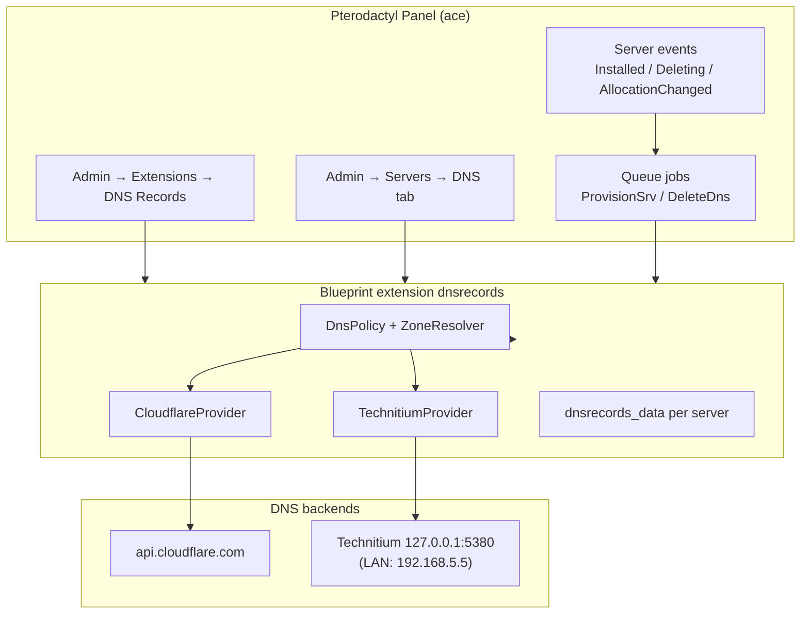
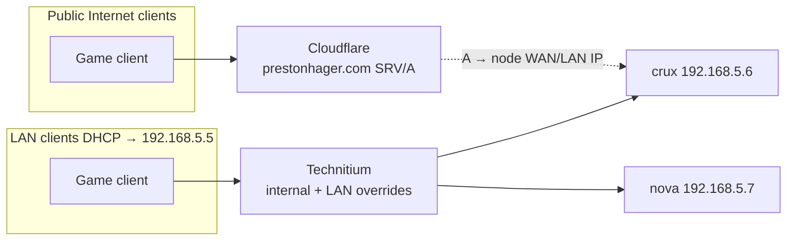

# Pterodactyl Blueprint Extension — DNS Records (SRV)

**Status:** Planning (partial implementation exists)  
**Updated:** 2026-06-26  
**Branch:** `dell-poweredge-r730xd`  
**Related:** [DNS on ace](../shared/dns.md), [Pterodactyl Test Blueprint](./pterodactyl-test-blueprint.md), [Pterodactyl on ace](./pterodactyl.md), [Port Forward plan](./pterodactyl-plugin-port-forward-plan.md)

---

## 1. Purpose

Allow Pterodactyl **admins** to manage DNS records for game servers from the panel — primarily **SRV** records keyed to game protocol, with optional **A/CNAME** support for vanity hostnames. Records should be creatable automatically when a server is installed or an allocation is assigned, and removed on server delete.

The extension must support **Cloudflare** (public Internet) and/or **Technitium** (LAN split-horizon on ace), selectable per deployment or per zone.

### Current state

| Item | Status |
|------|--------|
| Blueprint extension `dnsrecords` | Implemented in `plugins/pterodactyl-dns-blueprint/` |
| Cloudflare backend | Implemented (`Client`, `DnsService`, `SrvProvisioner`) |
| Technitium backend | **Not implemented** (planned) |
| Server install/delete hooks | Implemented (`OnServerInstalled`, `OnServerDeleting`) |
| SRV profiles (Minecraft, Factorio, …) | Implemented |
| Test panel install | `nixos/containers/pterodactyl-test-blueprint.nix` |
| Production panel | Blueprint + Social Login; DNS extension install TBD |

---

## 2. Goals and non-goals

### Goals

| Goal | Detail |
|------|--------|
| Dual-provider DNS | Cloudflare for public records; Technitium for `internal.prestonhager.com` / LAN overrides |
| SRV-first workflow | Game-aware presets (`_minecraft._tcp`, `_bedrock._udp`, etc.) tied to allocation ports |
| Admin-configurable | API tokens, zone IDs, provider selection, naming templates, SRV profiles — all in extension settings |
| Event-driven automation | Server installed → provision; allocation changed → update SRV port; server deleted → cleanup |
| Blueprint-native | Stock panel + Blueprint extension; no panel fork |

### Non-goals (initial phases)

- Client-facing DNS self-service tab (admin-only for v1; policy fields exist but client routes are disabled)
- Replacing Nix-managed Technitium zone sync (`technitium-zones.nix`) for infrastructure hostnames
- DNSSEC management
- Multi-tenant external DNS (Route53, etc.) beyond Cloudflare + Technitium

---

## 3. Architecture

### 3.1 High-level flow

### 3.2 Split-horizon (ace homelab)

Preferred Wings/node hostnames remain **`crux.lc1.nm.us.prestonhager.com`** and **`nova.lc1.nm.us.prestonhager.com`** (see [DNS on ace](../shared/dns.md)). SRV targets should reference these names or shorter LAN aliases (`crux.prestonhager.com`) depending on provider scope.

### 3.3 Blueprint extension layout

Follows existing `plugins/pterodactyl-dns-blueprint/` structure:

| Path | Role |
|------|------|
| `conf.yml` | Blueprint manifest (`identifier: dnsrecords`) |
| `admin/view.blade.php` | Global extension settings |
| `admin/wrapper.blade.php` | Per-server DNS tab injection |
| `app/Com/Prestonhager/Dns/` | Core logic (providers, jobs, listeners) |
| `routes/web.php` | Session-auth admin API |
| `routes/application.php` | Application API (automation) |
| `database/migrations/` | `dnsrecords_settings`, `dnsrecords_data` |
| `settings.schema.json` | Admin field definitions |

New work adds a **provider abstraction** (`DnsProviderInterface`) with `CloudflareProvider` (refactor existing) and `TechnitiumProvider` (new).

---

## 4. Admin UI mockups (descriptions)

### 4.1 Extension settings — **Admin → Extensions → DNS Records**

**Section: Provider**

| Control | Type | Notes |
|---------|------|-------|
| Primary provider | Select | `cloudflare`, `technitium`, `both` |
| Cloudflare API token | Password (masked) | Zone.DNS Edit + Zone.Zone Read |
| Default Cloudflare zone ID | Text | e.g. `prestonhager.com` zone |
| Technitium API URL | Text | Default `http://127.0.0.1:5380` (panel on ace reaches loopback) |
| Technitium API token / password | Password | Stored encrypted; prefer API token over admin password |
| Default Technitium zone | Select | `prestonhager.com`, `internal.prestonhager.com` |

**Section: Naming**

| Control | Type | Notes |
|---------|------|-------|
| Base domain | Text | Default apex for relative hostnames |
| Subdomain generation | Select | `server_slug`, `random_words`, `uuid_only` (existing) |
| SRV naming template | Text | e.g. `{subdomain}.{base_domain}` for SRV owner name |
| A record target template | Text | e.g. `{node_fqdn}` → resolves to Wings node hostname |
| Primary domains list | Repeating rows | Additional zones with per-row provider override |

**Section: SRV profiles**

Repeating table (existing UI): preset, service, proto, port override, priority, weight, **auto_provision** checkbox, **target provider** (inherit / cloudflare / technitium / both).

**Section: Automation**

| Control | Type | Notes |
|---------|------|-------|
| Auto-provision on install | Toggle | Existing `auto_provision_enabled` |
| Update on allocation change | Toggle | New — re-run SRV when primary port changes |
| Dry-run mode | Toggle | Log intended changes without API calls |

**Footer:** Test connection buttons (Cloudflare zone list, Technitium zone list), last sync status, link to audit log.

### 4.2 Per-server tab — **Admin → Servers → View → DNS**

Three-column layout:

1. **Summary** — Server UUID, node FQDN (`crux.lc1.nm.us…`), primary allocation IP:port, chosen subdomain, sync status badge (synced / pending / error).
2. **Records** — Editable table: Type, Name, Content, TTL, Provider, Actions (edit/delete). “Add record” modal with type selector. SRV rows show service/proto/port/target weight inline.
3. **SRV profiles** — Checkboxes for enabled profiles; “Provision selected” and “Sync from DNS” actions.

Toast notifications for async job completion; errors show provider response (redacted token).

---

## 5. API integrations

### 5.1 Cloudflare

| Operation | Endpoint | Notes |
|-----------|----------|-------|
| List zones | `GET /zones` | Validate token at setup |
| List/create/update/delete records | `GET/POST/PATCH/DELETE /zones/{zone_id}/dns_records` | Existing client |
| SRV content format | `{weight} {port} {target}` | Trailing dot on FQDN target |

**Constraints from [dns-ace.md](../shared/dns.md):**

- Ace Caddy apps: **DNS only (grey cloud)** — never orange-cloud to private LAN IPs.
- Game/node A records: Cloudflare A → node IP (currently `192.168.5.6` / `.7` for crux/nova lc1 names).

### 5.2 Technitium

Technitium HTTP API on ace (`127.0.0.1:5380`, UI at https://dns.prestonhager.com). Existing Nix services (`technitium-sync-zones.service`) use login + zone import pattern — extension should use the same API surface.

| Operation | API pattern (plan) | Notes |
|-----------|-------------------|-------|
| Login | `POST /api/user/login` | Token/session for subsequent calls |
| List zones | `GET /api/zones/list` | Confirm zone exists |
| Add/update/delete record | Zone records API | Match record types: A, CNAME, SRV, TXT |
| Idempotency | Match by name + type + zone | Avoid duplicates on re-provision |

**Conflict policy:** Records managed by Nix zone sync (`technitium-zones.nix`) for infrastructure names (`ace`, `crux`, `panel`, …) must be **reserved** — extension refuses to modify labels in `reserved_labels` + static infra list.

**Connectivity:** Panel Podman container on ace must reach `host.containers.internal:5380` or host gateway IP (verify same pattern as other ace-local services).

### 5.3 Pterodactyl panel events

| Event | Action |
|-------|--------|
| `Server\Installed` | Queue `ProvisionSrvProfilesJob` (existing) |
| `Server\Deleting` | Queue `DeleteDnsRecordsJob` (existing) |
| `Server\AllocationCreated` / `Updated` / `Deleted` | **New** — if primary allocation changed, update SRV port; optional A record |
| Manual admin action | CRUD via web routes |

---

## 6. Data model

### 6.1 Existing tables

**`dnsrecords_settings`** — key/value JSON for extension config (Blueprint settings API).

**`dnsrecords_data`** — scoped per-server state:

| Column | Example |
|--------|---------|
| `scope` | `server` |
| `subject_id` | server ID |
| `key` | `hostname`, `cloudflare_record_ids`, `technitium_record_ids`, `last_sync_at` |
| `value` | JSON blob |

### 6.2 Planned additions

**Settings keys (new):**

| Key | Type | Purpose |
|-----|------|---------|
| `dns_provider_mode` | enum | `cloudflare` \| `technitium` \| `both` |
| `technitium_api_url` | string | Base URL |
| `technitium_api_token` | secret | Encrypted |
| `technitium_default_zone` | string | Zone name |
| `srv_name_template` | string | Naming template |
| `update_on_allocation_change` | bool | Auto-update SRV ports |
| `provider_routing` | json | Per-zone or per-profile provider map |

**`dnsrecords_data` keys (new):**

| Key | Purpose |
|-----|---------|
| `provider_records` | Map `{ cloudflare: [...ids], technitium: [...ids] }` |
| `provision_log` | Last N operations for server tab display |

**`dnsrecords_audit_log`** (new table, phase 2):

| Column | Type |
|--------|------|
| `id` | bigint |
| `user_id` | nullable FK |
| `server_id` | nullable FK |
| `action` | string (`create`, `update`, `delete`, `provision`, `test_connection`) |
| `provider` | string |
| `record_name` | string |
| `details` | json (redacted) |
| `created_at` | timestamp |

---

## 7. Security

| Area | Control |
|------|---------|
| Credentials | API tokens in `dnsrecords_settings` encrypted at rest (Laravel `Crypt`); never logged; audit log redacts secrets |
| Authorization | Admin-only routes; `root_admin` or extension permission; no client API in v1 |
| Input validation | `SubdomainValidator`, reserved labels, RFC 1035 length, SRV port 1–65535 |
| Technitium scope | Restrict to game-related zones; block infra labels; read-only mode option |
| Cloudflare scope | Token scoped to single zone minimum permission |
| Rate limiting | Queue jobs with backoff; debounce allocation-changed events |
| Conflict with Nix | Document that `technitium-zones.nix` wins for infra records on next sync unless excluded |

---

## 8. Phased rollout

| Phase | Scope | Panel | Success criteria |
|-------|-------|-------|------------------|
| **0 — Done** | Cloudflare CRUD, SRV profiles, install/delete hooks | Test panel | Extension installs via Blueprint; records appear in Cloudflare |
| **1** | Provider abstraction + Technitium backend | Test panel | SRV created in Technitium zone; LAN `dig @192.168.5.5` resolves |
| **2** | Allocation-change listener + dual-provider `both` mode | Test panel | Port change updates SRV on both providers |
| **3** | Audit log + dry-run + connection tests | Test → prod | Admin can trace changes; prod deploy on `panel.prestonhager.com` |
| **4** | Nix integration | ace | Optional sops secret for Technitium token; document overlap with `technitium-zones.nix` |
| **5** | Client subdomain policy (optional) | Prod | Enable client routes if desired |

Deploy path mirrors [pterodactyl-test-blueprint.md](./pterodactyl-test-blueprint.md): edit `plugins/pterodactyl-dns-blueprint/`, `blueprint -build`, test on test.panel, then extend `nixos/containers/pterodactyl-blueprint.nix` for production.

---

## 9. Blueprint dependencies

| Dependency | Version / note |
|------------|----------------|
| Pterodactyl Panel | `release/v1.11.11` (stock) |
| Blueprint framework | `beta-2025-09`+ (see `conf.yml` `target`) |
| PHP queue worker | Required for async DNS jobs |
| Outbound HTTPS | Cloudflare API |
| Local HTTP | Technitium on ace loopback |

Install order (unchanged):

1. Stock panel reset
2. `blueprint.sh` first-time install
3. `blueprint -install` from `plugins/pterodactyl-dns-blueprint/`

---

## 10. Open questions

| # | Question | Options / notes |
|---|----------|-----------------|
| Q1 | Should public SRV target **node lc1 hostname** or a **game subdomain** CNAME? | lc1 names already in Cloudflare; game subdomain may be friendlier |
| Q2 | Technitium auth: API token vs admin password from `/stor/technitium/secrets/`? | Prefer dedicated API user/token; avoid panel reading root admin password file |
| Q3 | How to handle **Nix zone sync overwrite** for records the extension creates in `prestonhager.com`? | Exclude dynamic records in Nix; or use dedicated `games.internal.prestonhager.com` zone |
| Q4 | Allocation-changed: update all SRV profiles or only those bound to primary allocation? | Default: primary port for profiles without explicit port |
| Q5 | Production install timing: ship with Technitium or Cloudflare-only first? | Cloudflare-only already works; Technitium needed for LAN-first testing |
| Q6 | Integrate with **Port Forward extension** (see sibling plan)? | DNS + NAT should share server/port metadata; optional shared `pterodactyl_network` module later |
| Q7 | Grey-cloud vs orange-cloud per record type? | Force DNS-only for any record pointing at RFC1918 or node IPs |

---

## 11. References

| Doc / path | Content |
|------------|---------|
| [dns-ace.md](../shared/dns.md) | Technitium zones, Cloudflare patterns, lc1 hostnames |
| [pterodactyl-test-blueprint.md](./pterodactyl-test-blueprint.md) | Test panel Blueprint install |
| `plugins/pterodactyl-dns-blueprint/` | Extension source |
| `nixos/containers/technitium-zones.nix` | Authoritative infra records |
| [Port Forward plan](./pterodactyl-plugin-port-forward-plan.md) | WAN NAT for game ports |
