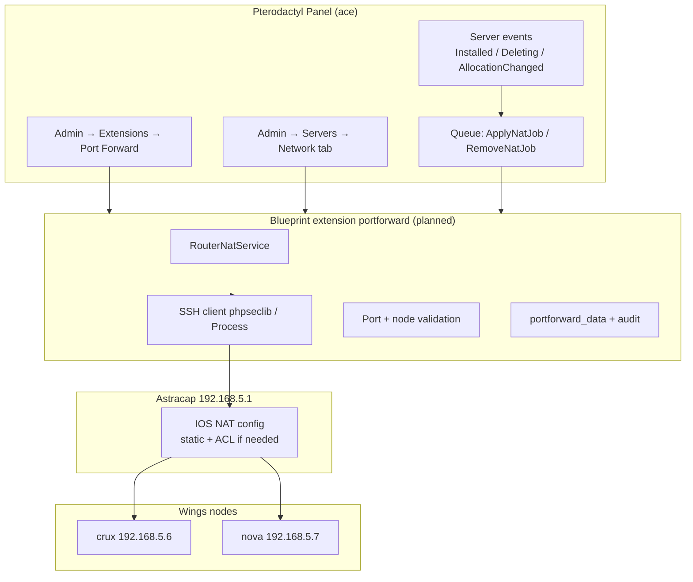
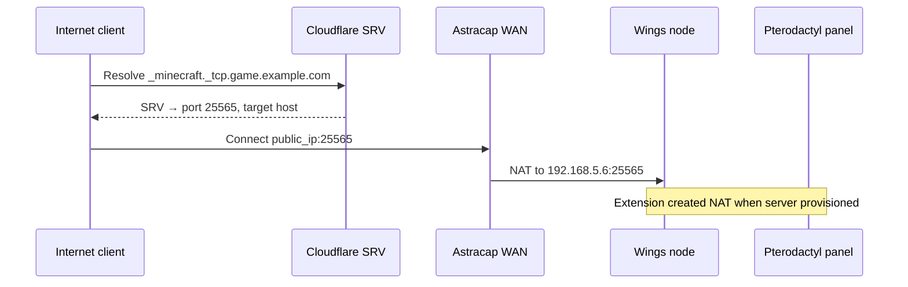
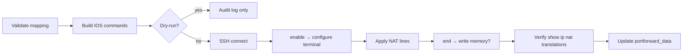

# Pterodactyl Blueprint Extension — Port Forwarding / NAT (Router)

**Status:** Planning only (not implemented)  
**Updated:** 2026-06-26  
**Branch:** `dell-poweredge-r730xd`  
**Related:** [Astracap router](../shared/network-astracap.md), [Network & SSH](../shared/network-ssh.md), [DNS Records plan](./pterodactyl-plugin-dns-records-plan.md), [Pterodactyl nodes](../pterodactyl-nodes/index.md)

---

## 1. Purpose

Allow Pterodactyl **admins** to create and remove **WAN port forwards** on the Astracap Cisco router (`192.168.5.1`) so Internet clients can reach game servers on Wings nodes **crux** (`192.168.5.6`) and **nova** (`192.168.5.7`). Configuration lives in the panel admin UI; the extension applies changes over **SSH** using stored credentials (never exposed to clients or logs).

This complements the [DNS Records extension plan](./pterodactyl-plugin-dns-records-plan.md): DNS advertises hostnames and SRV ports; NAT makes those ports reachable from the public Internet through the ISP WAN.

---

## 2. Goals and non-goals

### Goals

| Goal | Detail |
|------|--------|
| Router NAT automation | Add/remove static TCP/UDP NAT mappings on Astracap via SSH |
| Node-aware targeting | Map external port → crux or nova based on server's Pterodactyl node |
| Admin-only UI | Credentials, mappings, audit — all admin panel |
| Lifecycle hooks | Optional auto-forward when server installed / remove on delete |
| Safe operations | Validate ports, dry-run, audit log, rollback guidance |

### Non-goals (initial phases)

- Replacing full router config management (ACLs, DHCP, routing) in the panel
- Client self-service port requests
- Managing ace static NAT (80/443 → 192.168.5.5) — remains manual/Nix documented
- Non-Cisco router support
- IPv6 port forwarding

---

## 3. Environment context

From [network-astracap-router.md](../shared/network-astracap.md) and [dns-ace.md](../shared/dns.md):

| Item | Value |
|------|-------|
| Router | Cisco 2911, IOS 15.7(3)M8, hostname `Astracap` |
| LAN gateway | `192.168.5.1` on `GigabitEthernet0/2` (inside NAT) |
| WAN | `GigabitEthernet0/0` DHCP (outside NAT) |
| Existing static NAT | TCP **80**, **443** → **192.168.5.5** (ace Caddy) |
| Dynamic NAT | `ip nat inside source list 1 interface Gi0/0 overload` (PAT for LAN) |
| SSH | User **`prestonh`**, publickey-only ([network-ssh-ace.md](../shared/network-ssh.md)) |
| Wings nodes | crux `.6`, nova `.7`; FQDN `*.lc1.nm.us.prestonhager.com` |
| Public WAN | `ip1.lc1.nm.us.prestonhager.com` → `73.26.67.25` |

Game traffic typically needs **additional static NAT** entries: `WAN:game_port` → `192.168.5.6|7:game_port` for TCP and/or UDP.

---

## 4. Architecture

### 4.1 High-level flow



### 4.2 End-to-end game connectivity



### 4.3 Blueprint extension layout (proposed)

New directory: `plugins/pterodactyl-blueprint-port-forward/`

| Path | Role |
|------|------|
| `conf.yml` | `identifier: portforward` |
| `admin/view.blade.php` | Router connection + global policies |
| `admin/wrapper.blade.php` | Per-server port mapping tab |
| `app/Com/Prestonhager/PortForward/` | SSH, IOS command builder, jobs |
| `app/Com/Prestonhager/PortForward/Cisco/` | `NatRule`, `RunningConfigParser`, `ConfigApplier` |
| `routes/web.php` | Admin API |
| `database/migrations/` | Settings, per-server mappings, audit log |

---

## 5. Cisco IOS NAT patterns

Reference existing config from [network-astracap-router.md](../shared/network-astracap.md).

### 5.1 Static port forward (TCP)

```text
! Example: forward WAN TCP 25565 → crux 25565
ip nat inside source static tcp 192.168.5.6 25565 interface GigabitEthernet0/0 25565
```

UDP variant uses `static udp` (IOS syntax).

### 5.2 Extended ACL (if required)

Current edge config relies on NAT + VTY ACL only. If extended ACLs are added for WAN ingress filtering, each game port needs an explicit permit line **before** any deny. Plan for optional `access-list` integration in phase 2.

### 5.3 Idempotency strategy

| Approach | Pros | Cons |
|----------|------|------|
| **Parse `show running-config | section ip nat`** | Know existing rules | Fragile parsing |
| **Named object-group / remark tags** | Traceable `description PTERODACTYL-{server_uuid}` | Requires IOS object NAT or comments |
| **Dedicated stanza file on router** | Manual anchor | Out of scope |

**Recommended:** Append NAT lines with a **remark** or use a configurable **prefix** in an extended ACL comment; store exact IOS lines applied in `portforward_data` for deterministic removal:

```text
no ip nat inside source static tcp 192.168.5.6 25565 interface GigabitEthernet0/0 25565
```

### 5.4 Node → inside IP mapping

| Pterodactyl node FQDN / name | Inside IP |
|------------------------------|-----------|
| crux / `crux.lc1.nm.us.prestonhager.com` | 192.168.5.6 |
| nova / `nova.lc1.nm.us.prestonhager.com` | 192.168.5.7 |

Resolve via panel `Node` model; allow admin override mapping table in extension settings for future nodes.

---

## 6. Admin UI mockups (descriptions)

### 6.1 Extension settings — **Admin → Extensions → Port Forward**

**Section: Router connection**

| Control | Type | Notes |
|---------|------|-------|
| Enable extension | Toggle | Master kill switch |
| Router host | Text | Default `192.168.5.1` |
| SSH user | Text | Default `prestonh` |
| SSH private key | Textarea / secret | **Preferred** over password; loaded from sops at deploy |
| SSH key passphrase | Password | Optional |
| Enable password | Password | Cisco `enable` — for config mode if required |
| WAN interface | Text | Default `GigabitEthernet0/0` |
| Connection test | Button | `show ip interface brief` via SSH |

**Section: Policies**

| Control | Type | Notes |
|---------|------|-------|
| Allowed port range | Min/max | e.g. 1024–65535; block 80/443/22 |
| Allowed protocols | Multi-select | TCP, UDP |
| Blocked ports list | Tags | 22, 80, 443, 3380, … |
| Auto-forward on install | Toggle | Create NAT for primary allocation |
| Auto-remove on delete | Toggle | Default on |
| Dry-run mode | Toggle | Log IOS commands without SSH exec |
| Max mappings per server | Integer | Prevent abuse |

**Section: Node map**

Table: Pterodactyl node ID → LAN IP (pre-filled crux/nova).

**Footer:** Last connection status, link to audit log, warning banner about WAN exposure.

### 6.2 Per-server tab — **Admin → Servers → View → Network / NAT**

| Area | Content |
|------|---------|
| Header | Node name, inside IP, primary allocation port |
| Active mappings | Table: Protocol, External port, Internal port, Status (active/pending/failed), Created, Actions (remove) |
| Add mapping | Form: protocol, external port (default = allocation port), internal port (default same) |
| Suggested | Button “Forward primary allocation” pre-fills from server |
| History | Last 10 audit entries for this server |

Status badges: green (confirmed in running-config), yellow (queued), red (SSH/IOS error with sanitized message).

---

## 7. API and SSH integration

### 7.1 SSH from panel container

Panel runs in Podman on ace. SSH to `192.168.5.1` requires:

| Requirement | Approach |
|-------------|----------|
| Network path | ace → LAN → router (same subnet) |
| Host key verification | Pin Astracap host key in settings or `known_hosts` baked at deploy |
| Key material | **Not** in git — sops secret mounted into container or env injected by Nix |
| Legacy algorithms | IOS 15.7 needs `ssh-rsa`, `diffie-hellman-group14-sha1` (see [network-ssh-ace.md](../shared/network-ssh.md)) |

PHP options: `phpseclib/phpseclib` (pure PHP, algorithm control) or `symfony/process` invoking `ssh` binary with Match block config.

**Preferred:** Bundle `ssh` client in container with a drop-in config at `/etc/ssh/pterodactyl_portforward_config` mirroring home-manager `Host astracap` block.

### 7.2 Command workflow



**`write memory` policy:** Phase 1 — **do not** auto-save to NVRAM; running-config only (survives until reboot). Phase 2 — optional save with explicit admin confirmation. Document rollback: `no ip nat inside source static …`.

### 7.3 Internal admin API routes (planned)

```
/extensions/portforward/admin/settings/test-connection
/extensions/portforward/admin/servers/{serverId}/mappings
/extensions/portforward/admin/servers/{serverId}/mappings/{id}
/extensions/portforward/admin/audit
```

Application API (optional, phase 3):

```
/api/application/extensions/portforward/servers/{server}/mappings
```

---

## 8. Data model

### 8.1 `portforward_settings`

Key/value JSON (Blueprint pattern), same as DNS extension.

| Key | Type | Purpose |
|-----|------|---------|
| `enabled` | bool | Master switch |
| `router_host` | string | `192.168.5.1` |
| `router_ssh_user` | string | `prestonh` |
| `router_ssh_private_key` | secret | Encrypted |
| `router_enable_password` | secret | Encrypted |
| `wan_interface` | string | `GigabitEthernet0/0` |
| `allowed_port_min` / `max` | int | Policy |
| `blocked_ports` | json array | |
| `node_ip_map` | json | `{ "1": "192.168.5.6", ... }` |
| `auto_forward_on_install` | bool | |
| `dry_run` | bool | |

### 8.2 `portforward_data`

Per-server mappings (scope/subject pattern like DNS extension):

| key | value example |
|-----|---------------|
| `mappings` | `[{ "id", "protocol", "external_port", "internal_port", "ios_line", "status" }]` |

### 8.3 `portforward_audit_log`

| Column | Type |
|--------|------|
| `id` | bigint |
| `user_id` | FK |
| `server_id` | nullable FK |
| `action` | `create`, `delete`, `apply`, `remove`, `test_connection`, `dry_run` |
| `ios_commands` | text (redacted secrets) |
| `stdout` | text (truncated) |
| `success` | bool |
| `error_message` | text |
| `created_at` | timestamp |

---

## 9. Security

| Risk | Mitigation |
|------|------------|
| Router credential exposure | Store in encrypted settings or sops-mounted file; never return in API responses; mask in audit |
| Unauthorized port exposure | Admin-only; validate port allowlist; block privileged/low ports |
| SSH MITM | Pin host key; LAN-only target |
| Command injection | Never interpolate user input into shell; use structured IOS command builder; whitelist protocol enum |
| Privilege escalation on router | SSH user `prestonh` privilege 15 — accept risk for homelab; log all commands; consider limited custom role later |
| Denial of service | Rate-limit jobs; max mappings per server; queue concurrency 1 per router |
| Config drift | Running-config parse on startup reconcile job (phase 2) |
| Audit | Immutable audit log; optional Grafana alert on failed apply |

**Secrets storage options (pick one at implement time):**

1. Extension encrypted settings (same as Cloudflare token in DNS plugin)
2. sops file `nixos-secrets/secrets/containers/pterodactyl-router-ssh.yaml` mounted read-only into panel container
3. Bitwarden — **not** for automated panel use; human ops only

**Recommendation:** sops for SSH private key + enable password; extension reads from env path configured in `pterodactyl.nix`.

---

## 10. Pterodactyl event integration

| Event | Behavior |
|-------|----------|
| `Server\Installed` | If `auto_forward_on_install`, forward primary allocation port to node IP |
| `Server\Deleting` | Remove all mappings for server (if `auto_remove_on_delete`) |
| `Server\AllocationCreated` | Optional: forward additional allocation (off by default) |
| `Server\AllocationDeleted` | Remove matching mapping |

Coordinate with DNS extension: shared convention for “primary game port” (primary allocation of server).

---

## 11. Phased rollout

| Phase | Scope | Success criteria |
|-------|-------|------------------|
| **1 — Scaffold** | Blueprint extension skeleton, settings UI, dry-run command builder | Extension installs on test panel; IOS commands logged |
| **2 — SSH apply** | Real NAT add/remove on Astracap from test panel | Manual mapping crux test port; verified with external probe |
| **3 — Server tab + hooks** | Per-server UI, install/delete automation | New test server gets NAT; delete removes it |
| **4 — Hardening** | Audit log, host key pin, reconcile job, blocked ports | Failed apply visible in admin; no 80/443 forward allowed |
| **5 — Production** | sops secret, `pterodactyl-blueprint.nix` install | prod panel manages game NAT |
| **6 — Cross-extension** | Link DNS + NAT tabs; “provision public access” wizard | One-click SRV + NAT for Minecraft profile |

Test on **test.panel.prestonhager.com** first; production only after external connectivity verified from non-LAN client.

---

## 12. Blueprint dependencies

| Dependency | Note |
|------------|------|
| Pterodactyl Panel | Stock `1.11.11` |
| Blueprint | Same target as `dnsrecords` extension |
| PHP SSH library or openssh client | In panel container image |
| Queue worker | Async NAT apply |
| Network | Panel container → `192.168.5.1:22` |
| Secrets | sops or encrypted settings |

Install alongside DNS extension via `pterodactyl-test-blueprint.nix` / `pterodactyl-blueprint.nix` (add `-install portforward` step).

---

## 13. Verification plan

```bash
# From ace — SSH baseline (human)
ssh astracap "show ip nat translations"

# After extension applies mapping
ssh astracap "show running-config | include ip nat inside source static"

# External (non-LAN)
nc -vz 73.26.67.25 <game_port>

# Wings node — confirm listener
ssh root@192.168.5.6 "ss -ulnp | grep <port>"
```

Cross-check DNS: SRV port matches NAT external port.

---

## 14. Open questions

| # | Question | Notes |
|---|----------|-------|
| Q1 | ISP modem port forwarding vs Cisco WAN | Is `73.26.67.25` directly on router or double-NAT through modem? May need modem config too |
| Q2 | `write memory` default | Running-only is safer for automation; reboot loses rules |
| Q3 | UDP + TCP same port | Some games need both; apply two IOS lines |
| Q4 | Port range allocations | Pterodactyl may assign non-primary ports — forward all allocations or primary only? |
| Q5 | SSH key in container | Generate dedicated `pterodactyl-portforward` key vs reuse `id_rsa_astracap` |
| Q6 | ACL on WAN interface | If extended ACL added later, extension must manage permit lines |
| Q7 | Integration with IDS plan | [security-ids-plan.md](../shared/security-ids-plan.md) — alert on unexpected NAT changes |
| Q8 | crux/nova Cloudflare A to RFC1918 | Public DNS points to LAN IPs; NAT still required for WAN clients unless ISP routes public IPs to nodes |

---

## 15. References

| Doc / path | Content |
|------------|---------|
| [network-astracap-router.md](../shared/network-astracap.md) | NAT, interfaces, DHCP |
| [network-ssh-ace.md](../shared/network-ssh.md) | SSH user, key, legacy KEX |
| [dns-ace.md](../shared/dns.md) | lc1 hostnames, WAN IP |
| [pterodactyl-plugin-dns-records-plan.md](./pterodactyl-plugin-dns-records-plan.md) | SRV / hostname companion |
| [security-ids-plan.md](../shared/security-ids-plan.md) | Router change detection |
| `plugins/pterodactyl-dns-blueprint/` | Blueprint extension reference implementation |
