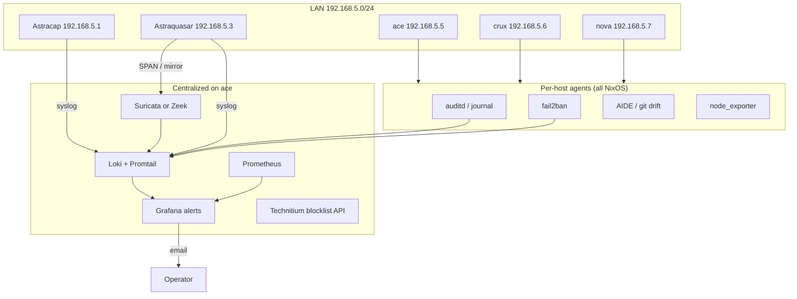
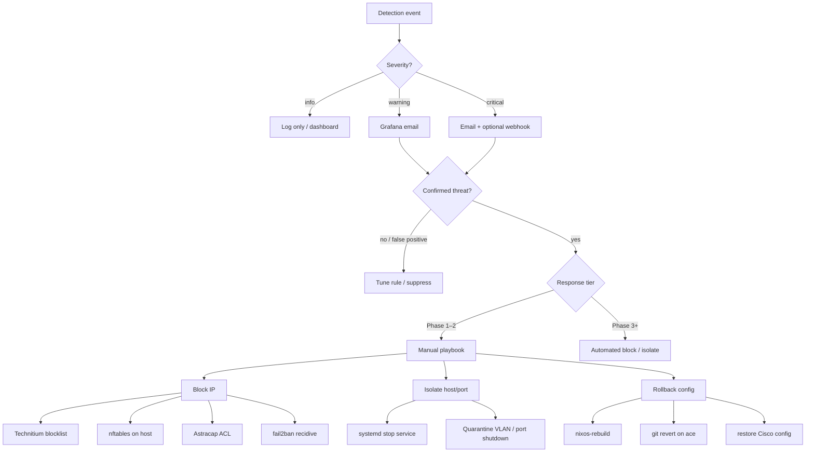
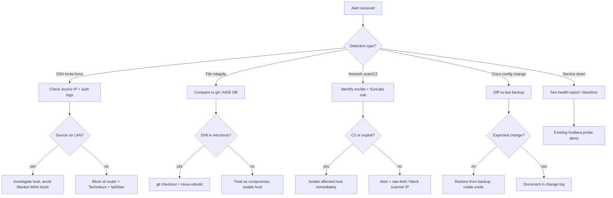

# Homelab IDS & Security Monitoring — Deployment Plan

**Status:** Planning only (not implemented)  
**Updated:** 2026-06-26  
**Branch:** `dell-poweredge-r730xd`  
**Scope:** ace, crux, nova (NixOS); Astracap router; Astraquasar switch; LAN `192.168.5.0/24` (and related subnets)

This document is a practical homelab plan for **detecting unauthorized changes and suspicious activity** and **responding** when something looks wrong. It references existing monitoring (`docs/monitoring-ace.md`) and network access patterns (`docs/network-ssh-ace.md`) but does not add NixOS modules or secrets.

---

## 1. Goals and non-goals

### Goals

| Goal | Examples |
|------|----------|
| **Detect config drift** | Files changed outside `nixos-rebuild`, `/etc/nixos` not matching git, unexpected packages in `/nix/store` |
| **Detect access abuse** | SSH brute force, sudo/privilege escalation, failed Cisco logins |
| **Detect network threats** | Port scans, lateral movement, suspicious DNS, known-malware C2 patterns |
| **Detect infra changes** | Router/switch ACL or VLAN edits without a documented change |
| **Enable informed response** | Alert → triage → block / isolate / rollback with documented playbooks |

### Non-goals (for this plan)

- Full SOC/SIEM enterprise stack
- Automated blocking without human approval in early phases
- Replacing NixOS declarative config as the source of truth
- Documenting secrets, firewall rules as code, or concrete nix module snippets

---

## 2. Environment summary

| Asset | IP | Role | Notes |
|-------|-----|------|-------|
| **ace** | 192.168.5.5 | Primary server | Technitium DNS, Caddy, Grafana/Prometheus, most Podman stacks |
| **crux** | 192.168.5.6 | Pterodactyl Wings | `crux.lc1.nm.us.prestonhager.com` |
| **nova** | 192.168.5.7 | Pterodactyl Wings | `nova.lc1.nm.us.prestonhager.com` |
| **Astracap** | 192.168.5.1 | Cisco IOS 15.7 router | Gateway, inter-VLAN routing |
| **Astraquasar** | 192.168.5.3 | Cisco WS-C3650 switch | L2/L3, candidate SPAN source |

**Existing observability (ace):** Grafana + Prometheus, blackbox probes, `node_exporter`, `ace-health-exporter`, email alerting via Grafana Unified Alerting. See `docs/monitoring-ace.md` and `docs/monitoring-external-probes.md`.

**Log aggregation today:** systemd journal on each host; container logs via Podman; no centralized Loki stack documented yet. Phase 1 should add a log path before heavy IDS rules.

---

## 3. Architecture overview

### 3.1 Sensor placement (target state)

**Design choice:** lightweight agents on **every** NixOS host; **heavy** network IDS and log store on **ace** (disk, CPU, already runs Grafana). crux/nova forward logs to ace over LAN (TLS or WireGuard if extended later).

### 3.2 Alert and response flow

### 3.3 Response decision tree (operator)

---

## 4. Detection coverage

### 4.1 NixOS hosts (ace, crux, nova)

| Detection | Tool / approach | Where | Phase | Notes |
|-----------|-----------------|-------|-------|-------|
| **Declarative config drift** | Periodic `git -C /etc/nixos status` + diff vs `origin` | All hosts | 1 | ace already uses git for auto-updates; extend timer to crux/nova |
| **Unexpected file changes** | AIDE (`services.aide`) on `/etc`, `/root`, selected `/var/lib` | All hosts | 2 | Baseline after each successful rebuild; email on mismatch |
| **Package / store tampering** | `nix-store --verify` timer; audit writes under `/nix` | All hosts | 2 | NixOS reduces but does not eliminate runtime drift (containers, `nix-shell`) |
| **SSH / login abuse** | `audit` rules for `authpriv`; `fail2ban` sshd jail | All hosts | 1 | Align with existing SSH hardening |
| **Privilege escalation** | auditd `execve` / `sudo` / `setuid` rules | All hosts | 2 | Forward to Loki; Grafana log-based alert |
| **Service changes outside NixOS** | systemd unit overrides; `podman` events; diff `/etc/systemd` | ace (priority) | 2 | Many services are Podman — monitor unit + container recreate events |
| **Outbound C2 (host-level)** | Optional osquery scheduled queries | ace first | 3 | Heavier; evaluate after Suricata |
| **Metrics anomalies** | Prometheus: connection count, disk, failed units | All hosts | 1 | Partially covered by `node_exporter` + ace-health |

**NixOS modules to evaluate (implementation later):** `services.aide`, `security.audit`, `services.fail2ban`, `systemd.services` timers for git/nix-store checks. No module code in this plan.

### 4.2 Network devices

| Detection | Tool / approach | Device | Phase | Notes |
|-----------|-----------------|--------|-------|-------|
| **Config change** | `archive config` / periodic `show run` capture + diff | Astracap, Astraquasar | 1 | Store in git-private repo or ace encrypted backup dir (not this repo) |
| **Login failures / AAA** | `login on-failure log`, `aaa authentication` logging, syslog to ace | Both | 1 | IOS: `logging host 192.168.5.5` |
| **ACL / VLAN changes** | Config diff + optional EEM on `config` | Both | 2 | Alert when `access-list`, `vlan`, `interface` blocks change |
| **SNMP polling** | SNMPv3 traps for link/state (optional) | Switch | 3 | Lower priority than syslog + config backup |

SSH access patterns: `docs/network-ssh-ace.md` (`ssh astracap`, `ssh astraquasar`).

### 4.3 Network-level IDS (LAN traffic)

| Detection | Tool | Placement | Phase | Notes |
|-----------|------|-----------|-------|-------|
| **Port scans, lateral movement** | Suricata (IDS mode) or Zeek | ace (NIC or SPAN feed) | 2 | Start with ET Open ruleset; tune for homelab noise |
| **DNS anomalies** | Technitium query logs + Suricata DNS rules | ace | 2 | ace is LAN DNS (`192.168.5.5:53`) |
| **Encrypted C2** | Zeek + JA3/SNI heuristics (limited) | ace | 3 | Expect gaps; defense in depth only |
| **East-west Wings traffic** | SPAN crux ↔ nova ↔ ace segments | Astraquasar | 2–3 | Requires switch mirror config |

**SPAN / mirror (Astraquasar):** Plan a monitor session sourcing uplink + server ports (ace, crux, nova) to a dedicated ace NIC or USB Ethernet if hardware allows. Validate mirror overhead on WS-C3650 before permanent enable.

---

## 5. Log aggregation and alerting

### 5.1 Target log pipeline

| Stage | Component | Host | Purpose |
|-------|-----------|------|---------|
| Collect | journald, auditd, fail2ban, Suricata EVE JSON | All → ace | Single search surface |
| Ship | Promtail (or Alloy) | ace, crux, nova | TLS to Loki on ace |
| Store | Loki | ace | Retention 14–30 days homelab |
| Correlate | Grafana | ace | Log + metric dashboards |
| Alert | Grafana Unified Alerting | ace | Reuse SMTP + `GRAFANA_ALERT_EMAILS` |

Reference: existing email alert rules in `docs/monitoring-ace.md` (service down, version behind). Add a new folder **Security** for IDS rules in Phase 2.

### 5.2 Alerting vs automated response

| Tier | Behavior | When |
|------|----------|------|
| **Tier 0 — Log only** | Dashboard / Loki explore | Phase 1 baselining, noisy rules |
| **Tier 1 — Email alert** | Grafana → `ace-email` contact point | Confirmed useful rules (Phase 2) |
| **Tier 2 — Semi-auto** | Webhook to script on ace (approval link, like `update.prestonhager.com`) | Block IP after one-click approve |
| **Tier 3 — Full auto** | fail2ban, nftables drop, Technitium API blocklist | Phase 3; LAN-only or WAN scanners only |

**Recommendation:** Stay on Tier 0–1 through Phase 2. Enable Tier 3 only for unambiguous cases (e.g. repeated SSH failures from WAN, Suricata `priority:1` with low false-positive rate).

### 5.3 Escalation path

1. **Grafana email** → primary operator (`GRAFANA_ALERT_EMAILS` in sops).
2. **Triage** using this doc + `docs/ace-health-report.md` for service context.
3. **If ace compromised:** treat Grafana alerts as untrusted; use out-of-band console (iDRAC) and secondary device.
4. **If network device compromised:** console/serial; rotate Vaultwarden Cisco credentials per `docs/network-ssh-ace.md`.

---

## 6. Response playbooks (options, not automation)

### 6.1 Detection → response matrix

| Detection | First response options | Stronger response | Recovery |
|-----------|------------------------|-------------------|----------|
| SSH brute force (WAN) | fail2ban ban; Grafana alert | Astracap ACL `deny ip`; Technitium blocklist | Unban after 24h or manual review |
| SSH brute force (LAN) | Alert; check originating host | Isolate source host VLAN; disable user key | Investigate Wings/game containers |
| sudo / privilege anomaly | audit log review | Disable account; `passwd -l` | `nixos-rebuild` if config changed |
| AIDE / git drift on `/etc/nixos` | `git diff`; intentional? | `git checkout -- .` + `nixos-rebuild switch` | Restore from ace git remote |
| Drift outside `/etc/nixos` | Identify package/service | Stop unit; snapshot disk | Rebuild host from flake |
| Suricata exploit alert | Verify target host | `nftables drop` attacker; stop service on victim | Patch / rebuild; restore from backup |
| Port scan (internal) | Identify scanner host | Switch port `shutdown` or quarantine VLAN | Malware scan on source |
| Technitium suspicious domain | Block domain in blocklist | Block client IP | Client remediation |
| Cisco config drift | `show archive config differences` | `configure replace` or restore txt | Re-apply authorized change properly |
| Compromised Wings node | Stop `wings.service` | Pull node from panel; firewall ace ↔ node | Reinstall crux/nova from flake |
| ace primary compromise | Isolate ace from LAN (router ACL) | Failover DNS (manual 1.1.1.1 on clients) | Full reinstall + restore volumes |

### 6.2 Blocking mechanisms (by layer)

| Layer | Mechanism | Pros | Cons |
|-------|-----------|------|------|
| Host | `nftables` / `iptables` drop | Fast, local | Per-host only |
| Host | fail2ban + recidive jail | Automated SSH | Can lock out operator IP |
| DNS | Technitium blocklist / deny zone | LAN-wide client protection | Bypass via DoH if not blocked |
| Router | Astracap extended ACL | WAN/LAN boundary | Syntax error risk; document rollback |
| Switch | `shutdown` interface | Hard isolation | Physical access needed to restore |
| Panel | Pterodactyl suspend server | Game workload isolation | Not OS-level |

### 6.3 Rollback and recovery

| Asset | Rollback path | Verification |
|-------|---------------|--------------|
| **ace NixOS** | `cd /etc/nixos && git revert && nixos-rebuild switch --flake .#ace` | `docs/ace-health-report.md` probes |
| **crux / nova** | Same pattern with `#crux` / `#nova` | Wings + panel connectivity |
| **Astracap / Astraquasar** | `copy flash:backup-config running-config` or `configure replace` | `show run` diff; SSH test |
| **Podman stacks (ace)** | Revert flake + rebuild; container images pinned in nix | Grafana blackbox `probe_success` |
| **Technitium** | Export zone before change; restore via API/UI | `dig @192.168.5.5` smoke tests |

---

## 7. Phased rollout

### Phase 1 — Audit, logging, baselines (4–6 weeks)

| Task | Hosts | Outcome |
|------|-------|---------|
| Enable auditd + sshd/fail2ban logging | ace, crux, nova | Auth events in journal |
| Syslog from Astracap + Astraquasar → ace | network | Central Cisco log view |
| Scheduled config backup (`show run`) + diff alert | router, switch | Unauthorized change detection |
| Git drift check timer on `/etc/nixos` | all NixOS | Alert on uncommitted or unpushed drift |
| Deploy Loki + Promtail on ace; ship journals from crux/nova | ace + nodes | Searchable logs in Grafana |
| Document baselines in private runbook | — | Expected open ports per host |

**Exit criteria:** Operator can answer “who logged in?” and “what changed on the router?” from Grafana/Loki without SSHing to each box.

### Phase 2 — Detection rules (4–8 weeks)

| Task | Outcome |
|------|---------|
| AIDE baselines post-rebuild | File integrity alerts |
| Suricata IDS on ace (inline or SPAN) | Scan/exploit detection |
| Grafana alert rules (Security folder) | Email on high-signal events |
| Technitium query logging review | Suspicious domain alerts |
| Config diff automation for Cisco | Email on unexpected `show run` change |
| Tune false positives | <1 benign alert/day |

**Exit criteria:** Controlled test (nmap scan, failed SSH burst) generates visible alert within 5 minutes.

### Phase 3 — Automated response (optional, 4+ weeks)

| Task | Guardrails |
|------|------------|
| fail2ban → nftables persistent bans | Max ban time; whitelist operator IPs |
| Technitium API blocklist from script | WAN sources only initially |
| Astracap ACL automation | Dry-run diff before apply |
| Switch port shutdown webhook | Require approval token |
| Optional: isolate Wings VLAN | Panel notification |

**Exit criteria:** Tabletop exercise: simulated compromise isolated without locking out operator.

---

## 8. Per-host notes

### ace (192.168.5.5)

- Highest value target: DNS, reverse proxy, secrets, monitoring, git `/etc/nixos` for auto-updates.
- Run Suricata/Loki here; protect with strict SSH (keys only), separate admin VLAN if feasible.
- Technitium blocklist is a powerful response lever for LAN clients.
- Reference: `docs/monitoring-ace.md`, `docs/dns-ace.md`.

### crux / nova (192.168.5.6 / .7)

- Untrusted workload surface (game servers, user containers).
- Prioritize forwarding logs to ace; local fail2ban for SSH.
- Limit east-west: ace ↔ node only required ports (Wings, NFS, panel API).
- Reference: `docs/site/src/pterodactyl-nodes/crux.md`, nova page.

### Astracap (192.168.5.1)

- Boundary between LAN and ISP; ACL changes affect everyone.
- Archive running config before/after intentional changes.
- AAA logging to ace; enable `login on-failure log` if not already.

### Astraquasar (192.168.5.3)

- SPAN source for IDS; port shutdown for node isolation.
- Mirror port to ace IDS NIC — validate CPU on switch during peak.

---

## 9. Testing and maintenance

| Activity | Frequency |
|----------|-----------|
| Run `nix-store --verify` on each host | Weekly (timer) |
| AIDE database update after `nixos-rebuild` | Each deploy |
| Cisco config backup diff | Daily |
| Suricata ruleset update | Weekly |
| Tabletop: SSH brute force + nmap | Quarterly |
| Review Grafana Security folder noise | Monthly |

**Health cross-check:** `docs/ace-health-report.md` remains the service availability snapshot; security alerts complement but do not replace blackbox probes.

---

## 10. Open decisions

| Decision | Options | Recommendation |
|----------|---------|----------------|
| Network IDS engine | Suricata vs Zeek | Suricata first (easier IPS path later); add Zeek if flow metadata needed |
| IDS traffic source | SPAN vs host packet capture on ace | SPAN from Astraquasar for east-west visibility |
| Log stack | Loki vs Elasticsearch | Loki (fits Grafana, lighter on ace) |
| osquery | On or skip | Skip until Phase 2 stable |
| Automated WAN block | Router vs Technitium vs both | Both for redundancy on Phase 3 |

---

## 11. Related documentation

| Doc | Relevance |
|-----|-----------|
| `docs/monitoring-ace.md` | Grafana, Prometheus, email alerting |
| `docs/monitoring-external-probes.md` | External vs LAN probe context |
| `docs/network-ssh-ace.md` | Cisco SSH, credentials in Vaultwarden |
| `docs/ace-health-report.md` | Service health baseline |
| `docs/dns-ace.md` | Technitium DNS (blocklist response) |
| Pterodactyl node pages | crux/nova workload context |

---

## Appendix A — NixOS service checklist (implementation reference)

When implementing, evaluate these NixOS options per host:

| Concern | Module / service |
|---------|------------------|
| File integrity | `services.aide` |
| Audit trail | `security.audit.enable`, custom rules |
| SSH abuse | `services.fail2ban`, `services.openssh` hardening |
| Periodic verification | `systemd.services` + `systemd.timers` for git/nix-store |
| Firewall | `networking.firewall` / `nftables` for drop lists |

Keep secrets in sops / Vaultwarden; keep this repo free of blocklist API keys and Cisco enable passwords.
